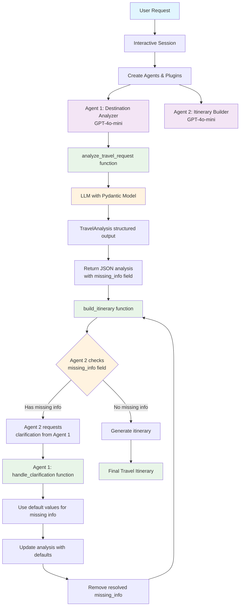

# Multi-Agent Travel Planner System

A powerful travel planning system built with **Semantic Kernel** that demonstrates multi-agent collaboration, plugins, structured output, and intelligent feedback loops.

## 🎯 **Quick Overview**

**Two Specialized Agents:**

- **Agent 1: Destination Analyzer (GPT-4o-mini)** - Extracts travel details using LLM with structured output
- **Agent 2: Itinerary Builder (GPT-4o-mini)** - Creates comprehensive travel itineraries

**Key Features:**

- ✅ **Structured Output** - Uses Pydantic models for guaranteed valid responses
- ✅ **No Hallucination** - Agents ask for missing info instead of guessing
- ✅ **Dynamic Destination Extraction** - Handles any destination from natural language
- ✅ **Intelligent Feedback Loops** - Proper agent coordination with clear roles
- ✅ **Plugin-Based Architecture** - Structured processing with kernel functions
- ✅ **Type Safety** - Compile-time validation with Pydantic models
- ✅ **Anti-Coordination Issues** - Agent 1 does NOT call handle_clarification directly

## 🚀 **Quick Start**

```bash
# Clone and setup
git clone <repository-url>
cd multi-agent-travel-planner

# Create virtual environment
python -m venv venv
source venv/bin/activate  # Windows: venv\Scripts\activate

# Install dependencies
pip install -r requirements.txt

# Setup environment
cp .env.example .env
# Edit .env with your OpenAI API key

# Run the system
python travel_planner.py
```

## 🏗 **Architecture**

### **Request Flow Through Components:**



**Key Coordination Rules:**

- **Agent 1** analyzes requests and returns structured output with missing_info
- **Agent 2** detects missing info and requests clarification from Agent 1
- **Agent 1** processes clarifications ONLY when Agent 2 asks
- **Agent 2** creates final itinerary when all info is complete

**Missing Info Detection Logic:**

- **Agent 1** extracts what it can and indicates missing_info in the response
- **Agent 2** checks the missing_info field and requests clarification if needed
- **Agent 1** does NOT detect missing info - it just analyzes and returns
- **Agent 2** is responsible for all missing info detection and clarification requests

## 🔌 **Plugin Architecture**

### **Core Plugins**

#### **1. DestinationAnalyzerPlugin**

**Purpose:** Extract structured travel information from natural language requests using LLM with Pydantic models.

**Functions:**

```python
@kernel_function(
    description="Analyze travel request and extract key information",
    name="analyze_travel_request"
)
async def analyze_travel_request(self, user_request: str) -> str:
    # LLM-based extraction with Pydantic TravelAnalysis model
    # Structured output with guaranteed valid JSON
    # Type-safe destination, duration, and purpose extraction
    # Returns missing_info field for Agent 2 to check
    return json.dumps(analysis)

@kernel_function(
    description="Handle clarifications from Agent 2 and update analysis",
    name="handle_clarification"
)
def handle_clarification(self, original_analysis: str, user_clarification: str) -> str:
    # Enhanced duration extraction with regex patterns
    # Update destination from user input
    # Remove resolved missing info from analysis
    # Return updated JSON analysis
    # NOTE: Only called when Agent 2 requests clarification
    return json.dumps(updated_analysis)
```

**Features:**

- **LLM-Powered Extraction** - Uses GPT-4o-mini for natural language understanding
- **Structured Output** - Pydantic TravelAnalysis model ensures valid responses
- **Type Safety** - Compile-time validation of data structures
- **Dynamic Destination Extraction** - Handles any destination from natural language
- **Enhanced Duration Processing** - Regex-based extraction for accurate user input
- **Anti-Hallucination** - Never guesses missing information
- **Proper Coordination** - Only processes clarifications when Agent 2 requests them
- **Clear Role Separation** - Agent 1 analyzes, Agent 2 detects missing info
- **LLM-Only Processing** - No fallback logic, relies on structured output

#### **2. ItineraryBuilderPlugin**

**Purpose:** Generate comprehensive travel itineraries based on analyzed data.

**Functions:**

```python
@kernel_function(
    description="Build travel itinerary based on analysis",
    name="build_itinerary"
)
def build_itinerary(self, analysis: str) -> str:
    # Check for missing info
    # Request clarification if needed
    # Generate specialized or general itinerary
    return itinerary_text

def _request_clarification(self, missing_info: List[str]) -> str:
    # Create clarification request JSON
    return json.dumps(clarification_request)

def _generate_japan_cherry_blossom_itinerary(self, duration: str) -> str:
    # Specialized Japan cherry blossom itinerary
    return detailed_itinerary

def _generate_general_itinerary(self, destination: str, duration: str, purpose: str) -> str:
    # General template for any destination
    return general_itinerary
```

**Features:**

- **Generic Itineraries** - Dynamic templates for any destination
- **LLM-Driven Content** - No hardcoded specific destinations or purposes
- **Quality Control** - Only creates itineraries with complete information
- **Practical Details** - Accommodation, transportation, and budget tips
- **Dynamic Day Planning** - Adapts itinerary length based on duration

### **Plugin Integration with Structured Output**

```python
# Pydantic model for structured output
class TravelAnalysis(KernelBaseModel):
    destination: str
    duration: str | None
    purpose: str
    missing_info: List[str]

# Kernel setup with plugins
kernel = Kernel()
destination_analyzer_plugin = DestinationAnalyzerPlugin()
itinerary_builder_plugin = ItineraryBuilderPlugin()

kernel.add_plugin(destination_analyzer_plugin, "DestinationAnalyzer")
kernel.add_plugin(itinerary_builder_plugin, "ItineraryBuilder")

# Agents use kernel plugins for consistent behavior
agents = [
    ChatCompletionAgent(
        name="Agent1_DestinationAnalyzer",
        description="Agent 1: Destination Analyzer (GPT-4o-mini)",
        instructions="Use analyze_travel_request and handle_clarification functions (only when Agent 2 asks)",
        service=OpenAIChatCompletion(ai_model_id="gpt-4o-mini"),
        kernel=kernel,
    ),
    ChatCompletionAgent(
        name="Agent2_ItineraryBuilder",
        description="Agent 2: Itinerary Builder (GPT-4o-mini)",
        instructions="Use build_itinerary function and request clarifications from Agent 1",
        service=OpenAIChatCompletion(ai_model_id="gpt-4o-mini"),
        kernel=kernel,
    ),
]
```

## 📋 **Example Usage**

### **Interactive Mode:**

```bash
✈️ Your travel request: Plan a trip to Japan for cherry blossoms
🔄 Planning your trip...
✅ Travel planning completed!
```

### **Sample Requests:**

1. `"Plan a trip to Japan for cherry blossoms."`
2. `"I want to visit Paris for 5 days."`
3. `"Plan a beach vacation in Bali."`
4. `"Create an itinerary for a business trip to New York."`

## 🔧 **Technical Features**

### **Agent Coordination Fix:**

The system ensures proper agent coordination by preventing Agent 1 from calling `handle_clarification` directly:

```python
# Agent 1 Instructions - Analysis only, no missing info detection
instructions="""You are Agent 1: Destination Analyzer (GPT-4o-mini). Your role is to:

1. **Use the analyze_travel_request function** to extract destination, duration, and purpose from travel requests
2. **Use the handle_clarification function** ONLY when Agent 2 asks for missing information
3. **DO NOT call handle_clarification directly** - only Agent 2 should request clarifications
4. **DO NOT detect missing info** - just analyze and return what you can extract
5. **Indicate missing info in missing_info field** for Agent 2 to check
6. **Provide structured JSON output** for Agent 2 to process

**CRITICAL: Do NOT call handle_clarification directly. Only Agent 2 should request clarifications.**"""

# Agent 2 Instructions - Responsible for missing info detection
instructions="""You are Agent 2: Itinerary Builder (GPT-4o-mini). Your role is to:

1. **Use the build_itinerary function** to create itineraries based on Agent 1's analysis
2. **Check the missing_info field** from Agent 1's analysis
3. **Request clarification from Agent 1** if missing_info is not empty
4. **Only create itineraries** when all required information is available
5. **Return the actual itinerary content** from the build_itinerary function

**IMPORTANT: You MUST use the available functions:**
- Use `build_itinerary` to process Agent 1's analysis and create itineraries
- **DO NOT add extra text or explanations** - just return the itinerary content
- **You are responsible for detecting missing info** - Agent 1 just analyzes and returns"""
```

**Coordination Flow:**

1. **Agent 1** analyzes request → returns JSON with missing_info
2. **Agent 2** detects missing info → requests clarification from Agent 1
3. **Agent 1** processes clarification → updates analysis with defaults
4. **Agent 2** creates itinerary → returns final travel plan

**Missing Info Detection:**

- **Agent 1**: Extracts what it can, indicates missing_info in response
- **Agent 2**: Checks missing_info field, requests clarification if needed
- **Agent 1**: Does NOT detect missing info - just analyzes and returns
- **Agent 2**: Responsible for all missing info detection and clarification requests

### **Structured Output Benefits:**

✅ **Guaranteed Valid Structure** - Pydantic models ensure only valid structured output
✅ **Type Safety** - Compile-time validation of data structures
✅ **Structured Communication** - Agents communicate with consistent data formats
✅ **Better Extraction** - More reliable parsing of destinations, durations, and purposes
✅ **Reduced Errors** - Fewer parsing errors and malformed responses
✅ **Tool Integration** - Perfect for function calling and plugin communication

### **LLM-Powered Analysis with Structured Output:**

```python
# Pydantic model for structured output
class TravelAnalysis(KernelBaseModel):
    destination: str
    duration: str | None
    purpose: str
    missing_info: List[str]

# LLM-based extraction with structured output
settings = OpenAIPromptExecutionSettings(
    max_tokens=200,
    temperature=0.1,  # Low temperature for consistent output
    function_choice_behavior=FunctionChoiceBehavior.Auto(),
    response_format=TravelAnalysis  # Use Pydantic model for structured output
)

# Get structured response from LLM
response = await llm_service.get_text_content(prompt, settings)
analysis = json.loads(response.text)

# Agent configuration
ChatCompletionAgent(
    service=OpenAIChatCompletion(
        ai_model_id="gpt-4o-mini"
    )
)
```

### **Enhanced Duration Extraction:**

```python
# Look for specific duration patterns with regex
if "7" in clarification_lower and ("day" in clarification_lower or "week" in clarification_lower):
    analysis["duration"] = "7 days"
elif "day" in clarification_lower:
    # Extract number of days from the text using regex
    import re
    numbers = re.findall(r'\d+', clarification_lower)
    if numbers:
        days = numbers[0]
        analysis["duration"] = f"{days} days"
    else:
        analysis["duration"] = "7 days"  # Default
```

### **Generic LLM-Driven Logic:**

```python
# Generic destination extraction - no hardcoded destinations
travel_keywords = [
    "to ", "visit ", "go to ", "travel to ", "trip to ", "vacation to ",
    "in ", "at ", "for ", "destination", "place"
]

# Generic duration extraction with regex patterns
duration_patterns = [
    r'(\d+)\s*days?', r'(\d+)\s*weeks?', r'(\d+)\s*months?'
]

# Generic purpose extraction - let LLM handle specific purposes
purpose = "General Travel"  # Default, let LLM extract specific purposes
```

## 🎓 **Learning Objectives**

This project demonstrates key **Semantic Kernel** concepts:

### **1. Structured Output with Pydantic**

- Creating Pydantic models for type-safe structured output
- Using `response_format` with Semantic Kernel
- Guaranteed valid JSON responses from LLMs

### **2. Plugin Development**

- Creating custom plugins with `@kernel_function`
- LLM-powered data extraction with structured output
- Type-safe communication between plugins

### **3. Agent Collaboration**

- Multi-agent systems with specialized roles
- Round-robin agent management
- Coordinated problem-solving with structured data

### **4. Intelligent Feedback Loops**

- **Agent 1** analyzes requests and returns structured output with missing_info
- **Agent 2** detects missing info and requests clarification from Agent 1
- **Agent 1** processes clarification requests using `handle_clarification` function ONLY when Agent 2 asks
- Complete information validation before itinerary creation
- **Missing Info Detection**: Only Agent 2 detects missing info, Agent 1 just analyzes and returns
- **Anti-coordination issues**: Agent 1 does NOT call handle_clarification directly

### **5. Real-World Application**

- Natural language processing for travel planning
- Structured output generation with modern LLM techniques
- Practical AI system development with type safety

## 📊 **Sample Output**

### **Japan Cherry Blossom Itinerary:**

```
# Japan Cherry Blossom Itinerary (7 days)

## Trip Overview
Experience the magical cherry blossom season in Japan!

## Day-by-Day Itinerary

### Day 1: Tokyo Arrival
- Arrive in Tokyo
- Check into hotel
- Visit Ueno Park for cherry blossoms
- Dinner at local restaurant

### Day 2: Tokyo Exploration
- Visit Yoyogi Park
- Walk along Meguro River (famous for cherry blossoms)
- Shopping in Ginza
- Evening hanami (cherry blossom viewing party)

[... continues with detailed 7-day itinerary ...]

## Tips
- Book accommodations 6-12 months in advance
- Be flexible with dates as bloom timing varies
- Pack light layers for spring weather
- Respect local customs during hanami parties
```

## 🛠 **Dependencies**

```
python-dotenv==1.0.0
semantic-kernel>=1.35.0
```

**Supported Models for Structured Output:**

- **OpenAI**: `gpt-4o-mini-2024-07-18` and later
- **Azure OpenAI**: `gpt-4o-2024-08-06` and later

## 📁 **Project Structure**

```
multi-agent-travel-planner/
├── travel_planner.py          # Main travel planner system
├── requirements.txt           # Python dependencies
├── README.md                 # This file
├── .env.example              # Environment template
├── .gitignore                # Git ignore rules
└── venv/                     # Virtual environment (ignored)
```

## 🤝 **Contributing**

This is a learning project demonstrating Semantic Kernel features. Feel free to:

1. **Extend the system** with more destinations and itineraries
2. **Add new plugins** for different travel planning aspects
3. **Improve the feedback loops** with more sophisticated clarification logic
4. **Enhance the UI** with web interfaces or chat bots

## 📚 **Resources**

- [Semantic Kernel Documentation](https://learn.microsoft.com/en-us/semantic-kernel/)
- [Structured Output with JSON Schema](https://devblogs.microsoft.com/semantic-kernel/using-json-schema-for-structured-output-in-python-for-openai-models/)
- [OpenAI API Documentation](https://platform.openai.com/docs)
- [Multi-Agent Systems](https://en.wikipedia.org/wiki/Multi-agent_system)
- [Pydantic Documentation](https://docs.pydantic.dev/)

---

**Perfect for beginners learning Semantic Kernel while building something useful and engaging!** 🎯
