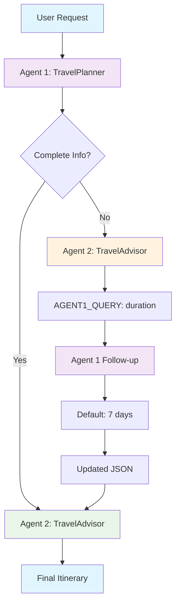

# Multi-Agent Travel Planner using Microsoft Semantic Kernel

A sophisticated multi-agent system that demonstrates agent-to-agent communication using Microsoft Semantic Kernel. The system uses three specialized agents that collaborate to create comprehensive travel itineraries.

## 🎯 System Overview

The system implements a **three-stage agent workflow** where agents communicate with each other to handle missing information and provide default values automatically.

## 🤖 Agent Architecture

### Agent Roles

1. **Agent 1 (TravelPlanner)**: Analyzes user requests and extracts structured data
2. **Agent 2 (TravelAdvisor)**: Creates itineraries or requests missing information from Agent 1
3. **Agent 1 Follow-up**: Provides default values when information is missing

## 🔄 Workflow Diagram



## 🏗️ Semantic Kernel Implementation

### Core Components

```python
# Kernel setup with OpenAI service
kernel = Kernel()
kernel.add_service(OpenAIChatCompletion(ai_model_id="gpt-4o-mini"))

# Agent creation using KernelFunctionFromPrompt
travel_planner = KernelFunctionFromPrompt(
    function_name="travel_planner",
    prompt=travel_planner_prompt,
    description="Analyzes travel requests and returns structured JSON data"
)
```

### Agent-to-Agent Communication

```python
# Agent 2 asks Agent 1 for missing info
if advisor_response.startswith("AGENT1_QUERY:"):
    query = advisor_response.replace("AGENT1_QUERY:", "").strip()

    # Agent 1 provides defaults
    followup_result = await kernel.invoke(travel_planner_followup, input=query)
    defaults_response = followup_result.value[0].content

    # Update travel data with defaults
    travel_data["duration"] = defaults_data["defaults"]["duration"]
```

### Default Value System

```python
# Agent 1 Follow-up provides sensible defaults
{
    "defaults": {
        "duration": "7 days",
        "budget": "moderate",
        "accommodation": "hotel",
        "transportation": "public transport"
    }
}
```

## 🚀 Usage

### Quick Start

```bash
# Setup environment
source venv/bin/activate
python3 travel_planner.py
```

### Example Interactions

**Request with missing duration:**

```
✈️ Your travel request: Plan a trip to Japan for cherry blossoms

🤖 Agent 1: Extracts JSON with missing duration
🤖 Agent 2: Requests missing info from Agent 1
🤖 Agent 1 Follow-up: Provides default "7 days"
🤖 Agent 2: Creates complete itinerary with 7-day duration
```

**Request with complete info:**

```
✈️ Your travel request: Plan a 5-day trip to Paris

🤖 Agent 1: Extracts complete JSON
🤖 Agent 2: Creates itinerary directly
```

## 📊 Key Features

### 1. **Intelligent Default Handling**

- Automatically provides 7-day duration when missing
- Maintains conversation flow without user interruption
- Preserves original request context

### 2. **Structured Data Flow**

- Agent 1: `User Request` → `JSON with missing_info`
- Agent 2: `JSON` → `Itinerary OR AGENT1_QUERY`
- Agent 1 Follow-up: `Query` → `Default Values JSON`

### 3. **Error Handling**

- JSON validation at each step
- Graceful fallback for parsing errors
- Comprehensive debug logging

## 🔧 Technical Details

### File Structure

```
travel_planner.py          # Main application
├── create_travel_planner_agent()      # Agent 1: Analyzer
├── create_travel_advisor_agent()      # Agent 2: Itinerary Creator
├── create_travel_planner_followup_agent() # Agent 1: Default Provider
└── run_multi_agent_workflow()         # Orchestration
```

### Agent Functions

```python
# Agent 1: TravelPlanner
def create_travel_planner_agent(kernel: Kernel) -> KernelFunctionFromPrompt

# Agent 2: TravelAdvisor
def create_travel_advisor_agent(kernel: Kernel) -> KernelFunctionFromPrompt

# Agent 1 Follow-up: Default Provider
def create_travel_planner_followup_agent(kernel: Kernel) -> KernelFunctionFromPrompt
```

## 🎓 Learning Outcomes

### Semantic Kernel Concepts

1. **KernelFunctionFromPrompt**: Creating agents from prompts
2. **Kernel Services**: Adding OpenAI services to kernels
3. **Async Invocation**: Using `await kernel.invoke()`
4. **JSON Parsing**: Handling structured responses
5. **Agent Communication**: Multi-step workflows

### Multi-Agent Patterns

1. **Agent-to-Agent Queries**: Using special prefixes like "AGENT1_QUERY:"
2. **Default Value Provision**: Automatic handling of missing information
3. **State Management**: Updating JSON data between agents
4. **Error Recovery**: Graceful handling of parsing failures

## 🔍 Debug Features

The system includes comprehensive logging:

```
[DEBUG] 🔄 Step 1: TravelPlanner analyzing request...
[DEBUG] 📋 TravelPlanner JSON response: {"destination": "Japan", "duration": null, "missing_info": ["duration"]}
[DEBUG] 🔄 Step 2: TravelAdvisor processing JSON...
[DEBUG] 🔄 Step 3: Agent 2 asking Agent 1 for missing info...
[DEBUG] 🔄 Step 4: TravelPlanner Follow-up providing defaults...
[DEBUG] 📋 Updated JSON with defaults: {"duration": "7 days"}
[DEBUG] 🔄 Step 5: TravelAdvisor creating final itinerary...
```

## 📚 References

- [Microsoft Semantic Kernel](https://github.com/microsoft/semantic-kernel)
- [KernelFunctionFromPrompt Documentation](https://learn.microsoft.com/en-us/semantic-kernel/agents/using-the-sdk/agents)
- [OpenAI Integration](https://learn.microsoft.com/en-us/semantic-kernel/ai-services/openai)

---

**Note**: This implementation demonstrates advanced multi-agent communication patterns using Microsoft Semantic Kernel's function-based approach.
