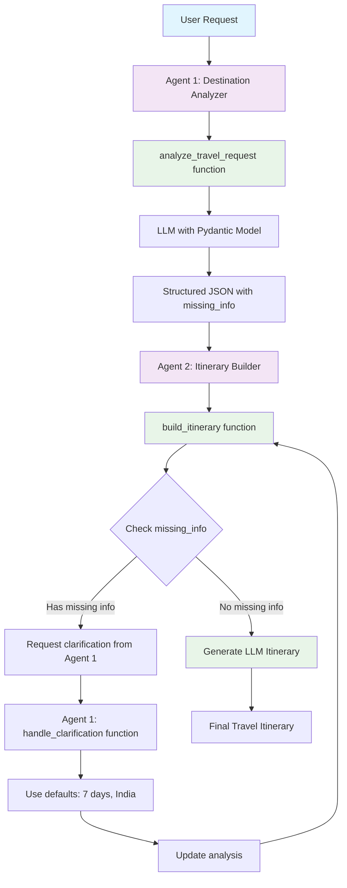

# Multi-Agent Travel Planner System

A **Semantic Kernel** multi-agent system demonstrating plugins, structured output, and intelligent feedback loops.

## 🏗 **1. Creating Kernel with Plugins and Multi-Agent System**

### **Kernel Setup with Plugins:**

```python
# Create kernel and plugins
kernel = Kernel()
destination_analyzer_plugin = DestinationAnalyzerPlugin()
itinerary_builder_plugin = ItineraryBuilderPlugin()

# Register plugins with kernel
kernel.add_plugin(destination_analyzer_plugin, "DestinationAnalyzer")
kernel.add_plugin(itinerary_builder_plugin, "ItineraryBuilder")
```

### **Multi-Agent Definition:**

```python
agents = [
    ChatCompletionAgent(
        name="Agent1_DestinationAnalyzer",
        description="Agent 1: Destination Analyzer (GPT-4o-mini)",
        instructions="Use analyze_travel_request and handle_clarification functions",
        service=OpenAIChatCompletion(ai_model_id="gpt-4o-mini"),
        kernel=kernel,  # Connect agent to kernel for plugin access
    ),
    ChatCompletionAgent(
        name="Agent2_ItineraryBuilder",
        description="Agent 2: Itinerary Builder (GPT-4o-mini)",
        instructions="Use build_itinerary function and request clarifications",
        service=OpenAIChatCompletion(ai_model_id="gpt-4o-mini"),
        kernel=kernel,  # Connect agent to kernel for plugin access
    ),
]
```

### **Group Chat Orchestration:**

```python
group_chat = GroupChatOrchestration(
    members=agents,
    manager=RoundRobinGroupChatManager(max_rounds=5),
)
```

## 🔄 **2. Multi-Agent Flow**



**Key Coordination Rules:**

- **Agent 1** analyzes → returns structured JSON with missing_info
- **Agent 2** detects missing info → requests clarification from Agent 1
- **Agent 1** processes clarifications → uses simple defaults
- **Agent 2** creates final itinerary when all info is complete

## 💬 **3. Group Chat and Agent Interaction in Semantic Kernel**

### **What is Group Chat?**

Group Chat in Semantic Kernel is a **conversation management system** that allows multiple agents to collaborate on a single task. Think of it as a **virtual meeting room** where agents can:

- **Take turns** speaking and contributing
- **Share information** and build on each other's responses
- **Coordinate actions** through structured communication
- **Maintain context** across the entire conversation

### **How Group Chat Works:**

```python
# 1. Create the group chat
group_chat = GroupChatOrchestration(
    members=agents,  # List of agents that can participate
    manager=RoundRobinGroupChatManager(max_rounds=5),  # Controls turn-taking
)

# 2. Start a conversation
result = await group_chat.invoke(
    task="Please help me plan a trip: 'Plan a trip to Japan'",
    runtime=runtime,  # Execution environment
)
```

### **Agent Turn-Taking with RoundRobinGroupChatManager:**

```python
# RoundRobinGroupChatManager controls who speaks when
manager=RoundRobinGroupChatManager(max_rounds=5)

# Turn sequence example:
# Round 1: Agent 1 speaks → Agent 2 speaks
# Round 2: Agent 1 speaks → Agent 2 speaks
# Round 3: Agent 1 speaks → Agent 2 speaks
# ... continues until max_rounds or task completion
```

### **How Agents Interact:**

#### **1. Message Passing:**

```python
# Agent 1 sends message to Agent 2
Agent1: "I analyzed the request. Here's the structured data: {destination: 'Japan', duration: null, missing_info: ['duration']}"

# Agent 2 receives and processes
Agent2: "I see missing duration. Let me request clarification from Agent 1."

# Agent 2 calls Agent 1's function
Agent2: *calls handle_clarification function*

# Agent 1 responds with updated data
Agent1: "Updated analysis: {destination: 'Japan', duration: '7 days', missing_info: []}"
```

#### **2. Function Calling Between Agents:**

```python
# Agent 2 can call Agent 1's functions through the kernel
Agent2: "I need to call Agent 1's handle_clarification function"

# The kernel provides access to all registered functions
kernel.add_plugin(destination_analyzer_plugin, "DestinationAnalyzer")
# Agent 2 can call: DestinationAnalyzer.handle_clarification()
```

#### **3. Context Sharing:**

```python
# All agents share the same conversation context
# Agent 1's analysis is available to Agent 2
# Agent 2's clarification request is available to Agent 1
# The conversation history is maintained throughout the session
```

### **Agent Communication Patterns:**

#### **Pattern 1: Sequential Processing**

```
User Request → Agent 1 (analyzes) → Agent 2 (builds) → Final Result
```

#### **Pattern 2: Feedback Loop**

```
User Request → Agent 1 (analyzes with missing info) → Agent 2 (detects missing info) → Agent 1 (clarifies) → Agent 2 (builds) → Final Result
```

#### **Pattern 3: Collaborative Refinement**

```
User Request → Agent 1 (initial analysis) → Agent 2 (suggests improvements) → Agent 1 (refines) → Agent 2 (final build) → Final Result
```

### **Key Features of Group Chat:**

#### **1. Turn Management:**

- **RoundRobinGroupChatManager**: Ensures fair turn-taking
- **max_rounds**: Prevents infinite loops
- **Automatic handoff**: Agents automatically pass control

#### **2. Context Preservation:**

- **Shared memory**: All agents see the full conversation
- **State tracking**: Previous responses influence future actions
- **Function results**: Output from one agent available to others

#### **3. Error Handling:**

- **Graceful degradation**: If one agent fails, others can continue
- **Retry logic**: Failed operations can be retried
- **Fallback mechanisms**: Alternative paths when primary fails

#### **4. Coordination Control:**

- **Task-level instructions**: Define how agents should coordinate
- **Agent-level instructions**: Define individual agent behavior
- **Function access**: Control which functions agents can call

### **Real Example from Travel Planner:**

```python
# Round 1: Agent 1 analyzes
Agent1: "I analyzed 'Plan a trip to Japan'. Here's my structured analysis:
{
  'destination': 'Japan',
  'duration': null,
  'purpose': 'General Travel',
  'missing_info': ['duration']
}"

# Round 2: Agent 2 detects missing info
Agent2: "I see duration is missing. I need to request clarification from Agent 1."

# Round 3: Agent 2 calls Agent 1's function
Agent2: "Calling DestinationAnalyzer.handle_clarification() with missing duration"

# Round 4: Agent 1 processes clarification
Agent1: "Processing clarification. Using default: 7 days. Updated analysis:
{
  'destination': 'Japan',
  'duration': '7 days',
  'purpose': 'General Travel',
  'missing_info': []
}"

# Round 5: Agent 2 creates itinerary
Agent2: "All info complete. Creating LLM-generated itinerary for Japan..."
```

### **Benefits of Group Chat:**

✅ **Collaborative Problem Solving** - Agents work together to solve complex tasks
✅ **Specialized Expertise** - Each agent focuses on their strengths
✅ **Quality Control** - Multiple agents can validate and improve results
✅ **Flexible Coordination** - Different patterns for different tasks
✅ **Scalable Architecture** - Easy to add more agents

## 🤖 **4. Agents, Plugins, and Tools**

### **Agent 1: Destination Analyzer**

**Role:** Extract structured travel information using LLM with Pydantic models.

**Plugin:** `DestinationAnalyzerPlugin`

**Functions:**

```python
@kernel_function
async def analyze_travel_request(self, user_request: str) -> str:
    # LLM-powered extraction with structured output
    # Returns JSON with destination, duration, purpose, missing_info
    return json.dumps(analysis)

@kernel_function
def handle_clarification(self, original_analysis: str, user_clarification: str) -> str:
    # Use simple defaults for missing information
    # Duration missing → "7 days"
    # Destination missing → "India"
    return json.dumps(updated_analysis)
```

**Features:**

- ✅ **LLM-Powered Analysis** - Uses GPT-4o-mini for natural language understanding
- ✅ **Structured Output** - Pydantic TravelAnalysis model ensures valid responses
- ✅ **Type Safety** - Compile-time validation of data structures
- ✅ **Simple Default Processing** - Uses fixed defaults for missing information
- ✅ **Anti-Hallucination** - Never guesses missing information

### **Agent 2: Itinerary Builder**

**Role:** Generate comprehensive travel itineraries based on analyzed data.

**Plugin:** `ItineraryBuilderPlugin`

**Functions:**

```python
@kernel_function
async def build_itinerary(self, analysis: str) -> str:
    # Check for missing info
    # Request clarification if needed
    # Generate LLM-powered itinerary
    return itinerary_text

def _request_clarification(self, missing_info: List[str]) -> str:
    # Create clarification request JSON
    return json.dumps(clarification_request)

async def _generate_general_itinerary(self, destination: str, duration: str, purpose: str) -> str:
    # LLM-powered itinerary generation
    # Dynamic, destination-specific content
    return llm_generated_itinerary
```

**Features:**

- ✅ **LLM-Driven Content** - Dynamic itineraries for any destination
- ✅ **Missing Info Detection** - Checks missing_info field from Agent 1
- ✅ **Quality Control** - Only creates itineraries with complete information
- ✅ **Practical Details** - Accommodation, transportation, and budget tips

### **Structured Output with Pydantic:**

```python
class TravelAnalysis(KernelBaseModel):
    destination: str
    duration: str | None
    purpose: str
    missing_info: List[str]

# LLM settings with structured output
settings = OpenAIPromptExecutionSettings(
    max_tokens=200,
    temperature=0.1,
    response_format=TravelAnalysis  # Use Pydantic model
)
```

## 🚀 **Quick Start**

```bash
# Setup
python -m venv venv
source venv/bin/activate
pip install -r requirements.txt

# Environment
cp .env.example .env
# Add your OPENAI_API_KEY

# Run
python travel_planner.py
```

## 📋 **Example Usage**

```bash
✈️ Your travel request: Plan a trip to Japan for cherry blossoms
🔄 Planning your trip...
✅ Travel planning completed!
```

**Sample Requests:**

- `"Plan a trip to Japan for cherry blossoms."`
- `"I want to visit Paris for 5 days."`
- `"Plan a beach vacation in Bali."`

## 🛠 **Dependencies**

```
python-dotenv==1.0.0
semantic-kernel>=1.35.0
```

---

**Perfect for learning Semantic Kernel multi-agent systems!** 🎯
