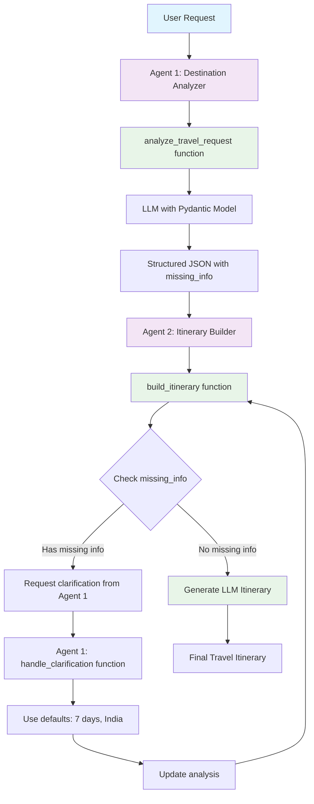

# Multi-Agent Travel Planner System

A **Semantic Kernel** multi-agent system demonstrating plugins, structured output, and intelligent feedback loops.

## 🏗 **1. Creating Kernel with Plugins and Multi-Agent System**

### **Kernel Setup with Plugins:**

```python
# Create kernel and plugins
kernel = Kernel()
destination_analyzer_plugin = DestinationAnalyzerPlugin()
itinerary_builder_plugin = ItineraryBuilderPlugin()

# Register plugins with kernel
kernel.add_plugin(destination_analyzer_plugin, "DestinationAnalyzer")
kernel.add_plugin(itinerary_builder_plugin, "ItineraryBuilder")
```

### **Multi-Agent Definition:**

```python
agents = [
    ChatCompletionAgent(
        name="Agent1_DestinationAnalyzer",
        description="Agent 1: Destination Analyzer (GPT-4o-mini)",
        instructions="Use analyze_travel_request and handle_clarification functions",
        service=OpenAIChatCompletion(ai_model_id="gpt-4o-mini"),
        kernel=kernel,  # Connect agent to kernel for plugin access
    ),
    ChatCompletionAgent(
        name="Agent2_ItineraryBuilder",
        description="Agent 2: Itinerary Builder (GPT-4o-mini)",
        instructions="Use build_itinerary function and request clarifications",
        service=OpenAIChatCompletion(ai_model_id="gpt-4o-mini"),
        kernel=kernel,  # Connect agent to kernel for plugin access
    ),
]
```

### **Group Chat Orchestration:**

```python
group_chat = GroupChatOrchestration(
    members=agents,
    manager=RoundRobinGroupChatManager(max_rounds=5),
)
```

## 🔄 **2. Multi-Agent Flow**



**Key Coordination Rules:**

- **Agent 1** analyzes → returns structured JSON with missing_info
- **Agent 2** detects missing info → requests clarification from Agent 1
- **Agent 1** processes clarifications → uses simple defaults
- **Agent 2** creates final itinerary when all info is complete

## 🤖 **3. Agents, Plugins, and Tools**

### **Agent 1: Destination Analyzer**

**Role:** Extract structured travel information using LLM with Pydantic models.

**Plugin:** `DestinationAnalyzerPlugin`

**Functions:**

```python
@kernel_function
async def analyze_travel_request(self, user_request: str) -> str:
    # LLM-powered extraction with structured output
    # Returns JSON with destination, duration, purpose, missing_info
    return json.dumps(analysis)

@kernel_function
def handle_clarification(self, original_analysis: str, user_clarification: str) -> str:
    # Use simple defaults for missing information
    # Duration missing → "7 days"
    # Destination missing → "India"
    return json.dumps(updated_analysis)
```

**Features:**

- ✅ **LLM-Powered Analysis** - Uses GPT-4o-mini for natural language understanding
- ✅ **Structured Output** - Pydantic TravelAnalysis model ensures valid responses
- ✅ **Type Safety** - Compile-time validation of data structures
- ✅ **Simple Default Processing** - Uses fixed defaults for missing information
- ✅ **Anti-Hallucination** - Never guesses missing information

### **Agent 2: Itinerary Builder**

**Role:** Generate comprehensive travel itineraries based on analyzed data.

**Plugin:** `ItineraryBuilderPlugin`

**Functions:**

```python
@kernel_function
async def build_itinerary(self, analysis: str) -> str:
    # Check for missing info
    # Request clarification if needed
    # Generate LLM-powered itinerary
    return itinerary_text

def _request_clarification(self, missing_info: List[str]) -> str:
    # Create clarification request JSON
    return json.dumps(clarification_request)

async def _generate_general_itinerary(self, destination: str, duration: str, purpose: str) -> str:
    # LLM-powered itinerary generation
    # Dynamic, destination-specific content
    return llm_generated_itinerary
```

**Features:**

- ✅ **LLM-Driven Content** - Dynamic itineraries for any destination
- ✅ **Missing Info Detection** - Checks missing_info field from Agent 1
- ✅ **Quality Control** - Only creates itineraries with complete information
- ✅ **Practical Details** - Accommodation, transportation, and budget tips

### **Structured Output with Pydantic:**

```python
class TravelAnalysis(KernelBaseModel):
    destination: str
    duration: str | None
    purpose: str
    missing_info: List[str]

# LLM settings with structured output
settings = OpenAIPromptExecutionSettings(
    max_tokens=200,
    temperature=0.1,
    response_format=TravelAnalysis  # Use Pydantic model
)
```

## 🚀 **Quick Start**

```bash
# Setup
python -m venv venv
source venv/bin/activate
pip install -r requirements.txt

# Environment
cp .env.example .env
# Add your OPENAI_API_KEY

# Run
python travel_planner.py
```

## 📋 **Example Usage**

```bash
✈️ Your travel request: Plan a trip to Japan for cherry blossoms
🔄 Planning your trip...
✅ Travel planning completed!
```

**Sample Requests:**

- `"Plan a trip to Japan for cherry blossoms."`
- `"I want to visit Paris for 5 days."`
- `"Plan a beach vacation in Bali."`

## 🛠 **Dependencies**

```
python-dotenv==1.0.0
semantic-kernel>=1.35.0
```

---

**Perfect for learning Semantic Kernel multi-agent systems!** 🎯
