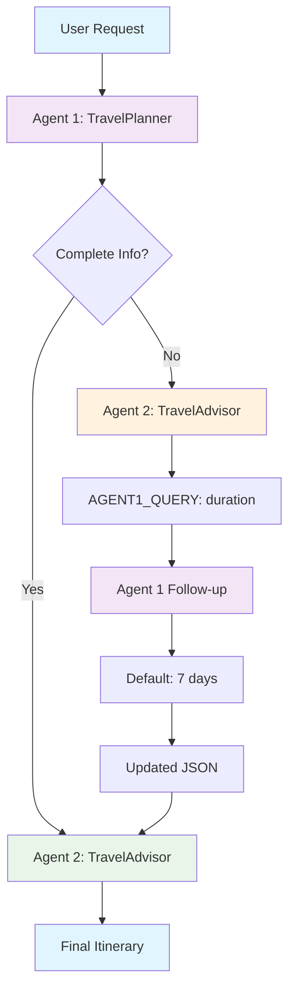

# Multi-Agent Travel Planner using Microsoft Semantic Kernel

A sophisticated multi-agent system that demonstrates agent-to-agent communication using Microsoft Semantic Kernel. The system uses three specialized agents that collaborate to create comprehensive travel itineraries.

## 🎯 System Overview

The system implements a **three-stage agent workflow** where agents communicate with each other to handle missing information and provide default values automatically.

## 🤖 Agent Architecture

### Agent Roles

1. **Agent 1 (TravelPlanner)**: Analyzes user requests and extracts structured data
2. **Agent 2 (TravelAdvisor)**: Creates itineraries or requests missing information from Agent 1
3. **Agent 1 Follow-up**: Provides default values when information is missing

## 🔄 Workflow Diagram



## 🏗️ Implementation Approaches

### Approach 1: Basic Semantic Kernel Functions (travel_planner.py)

**Current implementation** uses `KernelFunctionFromPrompt` to create individual functions:

```python
# Create individual functions
travel_planner = KernelFunctionFromPrompt(
    function_name="travel_planner",
    prompt=travel_planner_prompt,
    description="Analyzes travel requests and returns structured JSON data"
)

# Invoke functions directly
planner_result = await kernel.invoke(travel_planner, input=user_request)
```

**Pros:**

- Simple and straightforward
- Easy to understand for beginners
- Direct function invocation

**Cons:**

- No plugin organization
- Functions are scattered in code
- Less scalable for complex systems

### Approach 2: Semantic Kernel Plugins (travel_planner_with_plugins.py)

**Proper plugin implementation** uses `KernelPlugin` to organize related functions:

```python
# Create plugin with multiple functions
travel_planner_plugin = KernelPlugin(
    name="TravelPlanner",
    description="Plugin for analyzing travel requests and providing default values",
    functions=[analyze_request_function, provide_defaults_function]
)

# Add plugin to kernel
kernel.add_plugin(travel_planner_plugin)

# Invoke plugin functions with namespace
planner_result = await kernel.invoke("TravelPlanner", "analyze_request", input=user_request)
```

**Pros:**

- Proper Semantic Kernel plugin architecture
- Organized function grouping
- Better scalability and maintainability
- Clear namespace separation
- Follows Semantic Kernel best practices

**Cons:**

- More complex setup
- Requires understanding of plugin concepts

## 🚀 Usage

### Quick Start - Basic Approach

```bash
# Setup environment
source venv/bin/activate
python3 travel_planner.py
```

### Quick Start - Plugin Approach

```bash
# Setup environment
source venv/bin/activate
python3 travel_planner_with_plugins.py
```

### Example Interactions

**Request with missing duration:**

```
✈️ Your travel request: Plan a trip to Japan for cherry blossoms

🤖 Agent 1: Extracts JSON with missing duration
🤖 Agent 2: Requests missing info from Agent 1
🤖 Agent 1 Follow-up: Provides default "7 days"
🤖 Agent 2: Creates complete itinerary with 7-day duration
```

**Request with complete info:**

```
✈️ Your travel request: Plan a 5-day trip to Paris

🤖 Agent 1: Extracts complete JSON
🤖 Agent 2: Creates itinerary directly
```

## 📊 Key Features

### 1. **Intelligent Default Handling**

- Automatically provides 7-day duration when missing
- Maintains conversation flow without user interruption
- Preserves original request context

### 2. **Structured Data Flow**

- Agent 1: `User Request` → `JSON with missing_info`
- Agent 2: `JSON` → `Itinerary OR AGENT1_QUERY`
- Agent 1 Follow-up: `Query` → `Default Values JSON`

### 3. **Error Handling**

- JSON validation at each step
- Graceful fallback for parsing errors
- Comprehensive debug logging

## 🔧 Technical Details

### File Structure

```
travel_planner.py                    # Basic approach with functions
travel_planner_with_plugins.py       # Plugin-based approach
├── create_travel_planner_agent()    # Agent 1: Analyzer (basic)
├── create_travel_advisor_agent()    # Agent 2: Itinerary Creator (basic)
├── create_travel_planner_plugin()   # TravelPlanner Plugin (plugin approach)
├── create_travel_advisor_plugin()   # TravelAdvisor Plugin (plugin approach)
└── run_multi_agent_workflow()      # Orchestration
```

### Plugin Architecture (Plugin Approach)

```python
# TravelPlanner Plugin
travel_planner_plugin = KernelPlugin(
    name="TravelPlanner",
    functions=[
        analyze_request_function,      # analyze_request
        provide_defaults_function     # provide_defaults
    ]
)

# TravelAdvisor Plugin
travel_advisor_plugin = KernelPlugin(
    name="TravelAdvisor",
    functions=[
        create_itinerary_function,    # create_itinerary
        enhance_itinerary_function    # enhance_itinerary
    ]
)
```

### Function Invocation Comparison

**Basic Approach:**

```python
# Direct function invocation
planner_result = await kernel.invoke(travel_planner, input=user_request)
advisor_result = await kernel.invoke(travel_advisor, input=json_response)
```

**Plugin Approach:**

```python
# Plugin-based invocation with namespaces
planner_result = await kernel.invoke("TravelPlanner", "analyze_request", input=user_request)
advisor_result = await kernel.invoke("TravelAdvisor", "create_itinerary", input=json_response)
```

## 🎓 Learning Outcomes

### Semantic Kernel Concepts

1. **KernelFunctionFromPrompt**: Creating agents from prompts
2. **KernelPlugin**: Organizing functions into plugins
3. **Kernel Services**: Adding OpenAI services to kernels
4. **Async Invocation**: Using `await kernel.invoke()`
5. **JSON Parsing**: Handling structured responses
6. **Agent Communication**: Multi-step workflows

### Multi-Agent Patterns

1. **Agent-to-Agent Queries**: Using special prefixes like "AGENT1_QUERY:"
2. **Default Value Provision**: Automatic handling of missing information
3. **State Management**: Updating JSON data between agents
4. **Error Recovery**: Graceful handling of parsing failures

## 🔍 Debug Features

The system includes comprehensive logging:

```
[DEBUG] 🔄 Step 1: TravelPlanner.analyze_request analyzing request...
[DEBUG] 📋 TravelPlanner JSON response: {"destination": "Japan", "duration": null, "missing_info": ["duration"]}
[DEBUG] 🔄 Step 2: TravelAdvisor.create_itinerary processing JSON...
[DEBUG] 🔄 Step 3: TravelAdvisor asking TravelPlanner for missing info...
[DEBUG] 🔄 Step 4: TravelPlanner.provide_defaults providing defaults...
[DEBUG] 📋 Updated JSON with defaults: {"duration": "7 days"}
[DEBUG] 🔄 Step 5: TravelAdvisor.create_itinerary creating final itinerary...
[DEBUG] 🔄 Step 6: TravelAdvisor.enhance_itinerary enhancing itinerary...
```

## 📚 References

- [Microsoft Semantic Kernel](https://github.com/microsoft/semantic-kernel)
- [KernelPlugin Documentation](https://learn.microsoft.com/en-us/semantic-kernel/agents/using-the-sdk/plugins)
- [KernelFunctionFromPrompt Documentation](https://learn.microsoft.com/en-us/semantic-kernel/agents/using-the-sdk/agents)
- [OpenAI Integration](https://learn.microsoft.com/en-us/semantic-kernel/ai-services/openai)

---

**Note**: This implementation demonstrates both basic Semantic Kernel functions and proper plugin-based approaches for multi-agent communication patterns.
