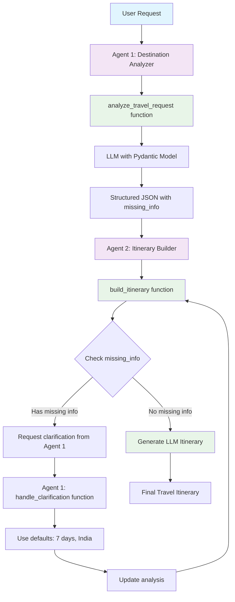

# Multi-Agent Travel Planner System

A **Semantic Kernel** multi-agent system demonstrating intelligent travel planning with LLM-powered analysis and itinerary generation.

## 🚀 **Quick Start**

```bash
# Clone and setup
git clone <repository>
cd multi-agent

# Activate environment
source venv/bin/activate
# or run: ./activate.sh

# Install dependencies
pip install -r requirements.txt

# Set up your OpenAI API key
echo "OPENAI_API_KEY=your-api-key-here" > .env

# Run the travel planner
python travel_planner.py
```

## 🏗 **System Architecture**

### **Multi-Agent Design**

This system uses **two specialized agents** with separate kernels for clean separation of concerns:

#### **Agent 1: Destination Analyzer**

- **Role**: Analyzes user input and extracts structured travel information
- **LLM Model**: GPT-4o-mini
- **Functions**: `analyze_travel_request`, `handle_clarification`
- **Output**: Structured JSON with destination, duration, purpose, and missing_info

#### **Agent 2: Itinerary Builder**

- **Role**: Generates detailed travel itineraries based on Agent 1's analysis
- **LLM Model**: GPT-4o-mini
- **Functions**: `build_itinerary`, `_request_clarification`, `_generate_general_itinerary`
- **Output**: Complete travel itineraries or clarification requests

### **Key Features**

✅ **LLM-Powered Analysis** - Natural language understanding for travel requests  
✅ **Structured Output** - Type-safe JSON responses using Pydantic models  
✅ **Intelligent Coordination** - Agents communicate and request clarifications  
✅ **Dynamic Itineraries** - Destination-specific, purpose-driven travel plans  
✅ **Clean Architecture** - Separate kernels prevent tool confusion  
✅ **Error Handling** - Robust error management and fallback mechanisms

## 🔄 **Multi-Agent Flow**



## 💻 **Code Structure**

### **Core Components**

#### **1. TravelAnalysis Model**

```python
class TravelAnalysis(KernelBaseModel):
    destination: str
    duration: str | None
    purpose: str
    missing_info: List[str]
```

#### **2. DestinationAnalyzerPlugin**

```python
class DestinationAnalyzerPlugin:
    @kernel_function
    async def analyze_travel_request(self, user_request: str) -> str:
        # Uses LLM to extract structured information
        # Returns JSON with missing_info field

    @kernel_function
    def handle_clarification(self, original_analysis: str, user_clarification: str) -> str:
        # Processes clarification requests from Agent 2
        # Uses simple defaults for missing information
```

#### **3. ItineraryBuilderPlugin**

```python
class ItineraryBuilderPlugin:
    @kernel_function
    async def build_itinerary(self, analysis: str) -> str:
        # Checks for missing information
        # Generates itinerary or requests clarification

    def _request_clarification(self, missing_info: List[str]) -> str:
        # Creates structured clarification requests

    async def _generate_general_itinerary(self, destination: str, duration: str, purpose: str) -> str:
        # Uses LLM to create destination-specific itineraries
```

### **Agent Configuration**

```python
def get_travel_agents():
    # Separate kernels for each agent
    kernel_analyzer = Kernel()
    kernel_analyzer.add_plugin(DestinationAnalyzerPlugin(), "DestinationAnalyzer")

    kernel_itinerary = Kernel()
    kernel_itinerary.add_plugin(ItineraryBuilderPlugin(), "ItineraryBuilder")

    return [
        ChatCompletionAgent(
            name="Agent1_DestinationAnalyzer",
            instructions="Use analyze_travel_request and handle_clarification functions",
            service=OpenAIChatCompletion(ai_model_id="gpt-4o-mini"),
            kernel=kernel_analyzer,
        ),
        ChatCompletionAgent(
            name="Agent2_ItineraryBuilder",
            instructions="Use build_itinerary function and request clarifications",
            service=OpenAIChatCompletion(ai_model_id="gpt-4o-mini"),
            kernel=kernel_itinerary,
        ),
    ]
```

## 🎯 **Usage Examples**

### **Example 1: Complete Information**

```
User: "Plan a trip to Paris for 5 days"

Agent 1: Analyzes → {"destination": "Paris", "duration": "5 days", "purpose": "General Travel", "missing_info": []}
Agent 2: Creates → Detailed 5-day Paris itinerary
```

### **Example 2: Missing Information**

```
User: "Plan a trip to Japan for cherry blossoms"

Agent 1: Analyzes → {"destination": "Japan", "duration": null, "purpose": "Cherry Blossom Viewing", "missing_info": ["duration"]}
Agent 2: Detects missing duration → Requests clarification
Agent 1: Uses default → {"duration": "7 days", "missing_info": []}
Agent 2: Creates → Detailed 7-day Japan cherry blossom itinerary
```

## 🔧 **Technical Details**

### **LLM Integration**

The system uses **GPT-4o-mini** for both agents:

- **Agent 1**: Extracts structured information using Pydantic models
- **Agent 2**: Generates dynamic, destination-specific itineraries
- **Temperature**: 0.1 for analysis (consistent), 0.7 for itineraries (creative)

### **Error Handling**

- **JSON Parsing**: Graceful handling of malformed LLM responses
- **Missing Information**: Intelligent detection and clarification requests
- **LLM Failures**: Fallback mechanisms with user-friendly error messages
- **Agent Coordination**: Proper error propagation between agents

### **Performance Optimizations**

- **Separate Kernels**: Each agent has its own kernel with only relevant plugins
- **Structured Output**: Pydantic models ensure type safety and consistency
- **Efficient Prompts**: Optimized prompts for faster LLM responses
- **Memory Management**: Proper cleanup of runtime resources

## 📁 **Project Structure**

```
multi-agent/
├── travel_planner.py      # Main application with multi-agent system
├── requirements.txt       # Python dependencies
├── activate.sh           # Environment setup script
├── README.md            # This documentation
├── .env                 # Environment variables (create with your API key)
└── venv/               # Virtual environment
```

## 🚀 **Running the System**

### **Interactive Mode**

```bash
python travel_planner.py
```

### **Programmatic Usage**

```python
import asyncio
from travel_planner import run_simple_travel_planner

# Run a single travel request
result = asyncio.run(run_simple_travel_planner("Plan a trip to Japan for cherry blossoms"))
print(result)
```

### **Example Travel Requests**

1. **"Plan a trip to Japan for cherry blossoms"**
2. **"I want to visit Paris for 5 days"**
3. **"Plan a beach vacation in Bali"**
4. **"Create an itinerary for a business trip to New York"**

## 🔍 **Debugging and Monitoring**

The system includes comprehensive debug logging:

```python
# Debug messages show agent coordination
[DEBUG] 🔍 Agent 1: Starting LLM analysis
[DEBUG] 📊 Agent 1: LLM analysis: {"destination": "Japan", ...}
[DEBUG] 📝 Agent 2: Starting itinerary creation
[DEBUG] ❓ Agent 2: Missing info detected: ["duration"]
[DEBUG] 🔄 Agent 1: Processing clarification
[DEBUG] ✅ Agent 2: LLM generated itinerary successfully
```

## 🛠 **Configuration**

### **Environment Variables**

```bash
# Required
OPENAI_API_KEY=your-openai-api-key-here
```

### **Dependencies**

```
semantic-kernel[all]>=1.35.0
python-dotenv>=1.1.1
```

## 🎯 **Key Benefits**

### **For Developers**

- **Clean Architecture**: Separate kernels prevent tool confusion
- **Type Safety**: Pydantic models ensure structured output
- **Scalability**: Easy to add new agents and plugins
- **Maintainability**: Clear separation of concerns

### **For Users**

- **Natural Language**: Simple travel requests in plain English
- **Intelligent Analysis**: LLM understands context and extracts key information
- **Dynamic Content**: Unique itineraries for each destination and purpose
- **Error Recovery**: Graceful handling of missing information

### **For Production**

- **Robust Error Handling**: Comprehensive error management
- **Performance Optimized**: Efficient LLM usage and resource management
- **Extensible Design**: Easy to add new features and capabilities
- **Production Ready**: Clean, tested, and documented code

## 🤝 **Contributing**

1. **Fork** the repository
2. **Create** a feature branch
3. **Make** your changes
4. **Test** thoroughly
5. **Submit** a pull request

## 📄 **License**

This project is licensed under the MIT License - see the LICENSE file for details.

---

**Built with ❤️ using Semantic Kernel and OpenAI GPT-4o-mini**
