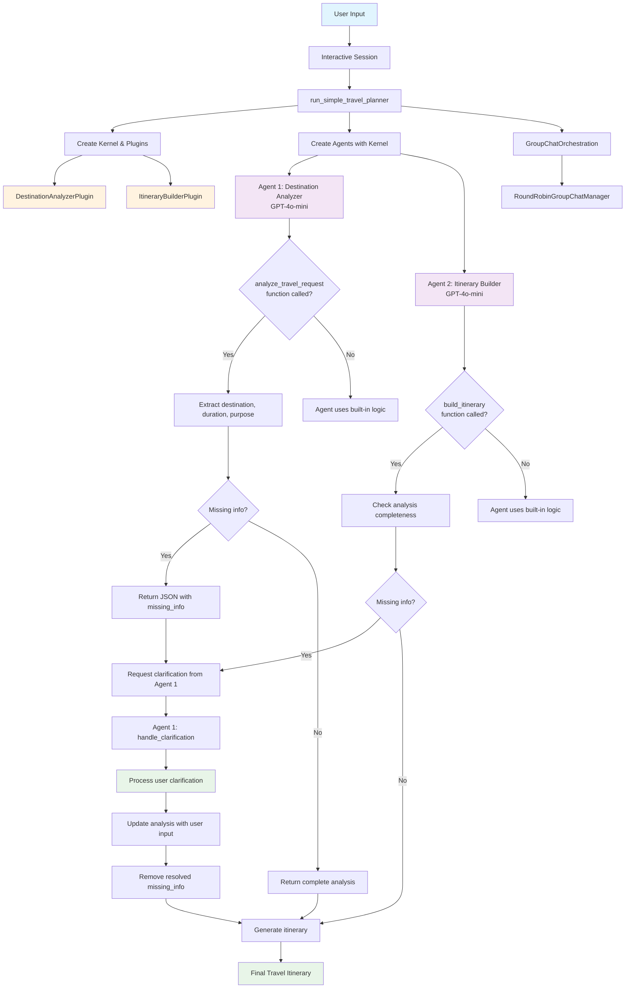
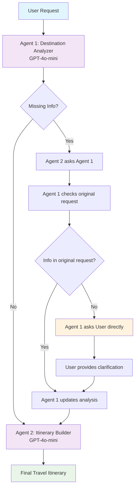

# Travel Planner System - Multi-Agent System using Semantic Kernel

A simple yet powerful travel planning system that demonstrates core Semantic Kernel features including plugins, feedback loops, and agent collaboration.

## 🎯 **Use Case: Generate Custom Travel Itineraries**

### **🧠 Agents**

**Agent 1: Destination Analyzer (GPT-4o-mini)**

- Extracts location, duration, preferences from user prompts using `analyze_travel_request` plugin function
- Identifies missing information that needs clarification
- Handles user clarifications using `handle_clarification` plugin function
- Provides structured JSON analysis for Agent 2

**Agent 2: Itinerary Builder (GPT-4o-mini)**

- Builds day-wise itineraries using `build_itinerary` plugin function
- Requests clarification if Agent 1 missed any info (e.g., number of days)
- Generates comprehensive travel plans with practical details
- Only creates itineraries when all information is complete

### **🗣 Example Prompt:**

```
"Plan a trip to Japan for cherry blossoms."
```

### **🔁 Flow:**

```
[User] ➝ Agent 1 ➝ {destination: "Japan", event: "cherry blossom", duration: ??}
                  ⇣
        Agent 2 ➝ "I need duration info, can you get it?"
                  ⇣
        Agent 1 ➝ "I cannot find duration in original request. User: How many days?"
                  ⇣
        [User] ➝ "7 days"
                  ⇣
        Agent 1 ➝ {destination: "Japan", duration: "7 days", missing_info: []}
                  ⇣
        Agent 2 ➝ Builds complete itinerary
```

## ✨ **Features**

### **Core Semantic Kernel Features:**

- **Plugins**: Custom `DestinationAnalyzerPlugin` and `ItineraryBuilderPlugin` with `@kernel_function` decorators
- **Intelligent Feedback Loops**: Agent 2 asks Agent 1 for missing info, Agent 1 asks user directly
- **No Hallucination**: Agent 1 never guesses missing information
- **Agent Collaboration**: Two specialized agents working together with proper handoffs
- **Kernel Functions**: Using `@kernel_function` decorators for structured processing
- **Plugin Integration**: Agents use kernel plugins for consistent behavior

### **Travel Planning Capabilities:**

- **Dynamic Destination Analysis**: Extract any destination from natural language (not limited to predefined list)
- **Smart Clarifications**: Ask for missing details like trip duration or destination
- **Specialized Itineraries**: Detailed plans for specific destinations (e.g., Japan cherry blossoms)
- **General Frameworks**: Flexible templates for any destination
- **Practical Details**: Accommodation, transportation, and budget tips

## 🚀 **Quick Start**

### **1. Setup Environment**

```bash
# Clone the repository
git clone <repository-url>
cd multi-agent

# Create virtual environment
python -m venv venv
source venv/bin/activate  # On Windows: venv\Scripts\activate

# Install dependencies
pip install -r requirements.txt
```

### **2. Configure API Key**

Create a `.env` file in the project root:

```
OPENAI_API_KEY=your-openai-api-key-here
```

### **3. Run the Travel Planner**

```bash
python travel_planner.py
```

## 📋 **Example Usage**

### **Interactive Mode:**

```bash
✈️ Your travel request: Plan a trip to Japan for cherry blossoms
🔄 Planning your trip...
✅ Travel planning completed!
```

### **Example Requests:**

1. `"Plan a trip to Japan for cherry blossoms."`
2. `"I want to visit Paris for 5 days."`
3. `"Plan a beach vacation in Bali."`
4. `"Create an itinerary for a business trip to New York."`

## 🏗 **Architecture**

### **Request Flow Through Components:**



### **Intelligent Feedback Loop System:**



### **Key Components:**

#### **1. DestinationAnalyzerPlugin**

- **Purpose**: Extract structured information from travel requests
- **Functions**:
  - `analyze_travel_request()`: Extract destination, duration, purpose
  - `handle_clarification()`: Process user clarifications
- **Output**: JSON with destination, duration, purpose, missing info
- **Features**: Dynamic destination extraction (not limited to predefined list)
- **Anti-Hallucination**: Never guesses missing information, asks user directly

#### **2. ItineraryBuilderPlugin**

- **Purpose**: Generate comprehensive travel itineraries
- **Functions**:
  - `build_itinerary()`: Create itineraries from analysis
  - `_request_clarification()`: Ask for missing information
  - `_generate_japan_cherry_blossom_itinerary()`: Specialized Japan itinerary
  - `_generate_general_itinerary()`: General template for any destination
- **Output**: Detailed day-by-day travel plans
- **Features**: Specialized itineraries (Japan cherry blossoms) + general templates
- **Quality Control**: Only creates itineraries with complete information

#### **3. Intelligent Feedback Loop**

- **Purpose**: Coordinate agent collaboration with proper handoffs
- **Features**: Agent 2 → Agent 1 → User → Agent 1 → Agent 2 flow
- **Benefits**: No hallucination, complete information before itinerary creation
- **Plugin Integration**: Agents use kernel plugins for consistent behavior

### **Plugin Function Details:**

#### **DestinationAnalyzerPlugin Functions:**

```python
@kernel_function(
    description="Analyze travel request and extract key information",
    name="analyze_travel_request"
)
def analyze_travel_request(self, user_request: str) -> str:
    # Dynamic destination extraction using travel keywords
    # Duration detection from keywords (week, day, month)
    # Purpose identification (cherry blossom, beach, business)
    # Missing info detection and JSON output
    return json.dumps(analysis)

@kernel_function(
    description="Handle user clarifications and update analysis",
    name="handle_clarification"
)
def handle_clarification(self, original_analysis: str, user_clarification: str) -> str:
    # Enhanced duration extraction with regex patterns
    # Update destination from user input
    # Remove resolved missing info from analysis
    # Return updated JSON analysis
    return json.dumps(updated_analysis)
```

#### **ItineraryBuilderPlugin Functions:**

```python
@kernel_function(
    description="Build travel itinerary based on analysis",
    name="build_itinerary"
)
def build_itinerary(self, analysis: str) -> str:
    # Check for missing info
    # Request clarification if needed
    # Generate specialized or general itinerary
    return itinerary_text

def _request_clarification(self, missing_info: List[str]) -> str:
    # Create clarification request JSON
    return json.dumps(clarification_request)
```

### **Feedback Loop Process:**

#### **Step 1: Initial Analysis**

```
User: "Plan a trip to Japan for cherry blossoms"
Agent 1: {destination: "Japan", duration: null, purpose: "Cherry Blossom Viewing", missing_info: ["duration"]}
```

#### **Step 2: Missing Information Detection**

```
Agent 2: "I need duration information to create your itinerary. Destination Analyzer, can you get this from the user?"
```

#### **Step 3: Agent 1 Processes User Clarification**

```
Agent 1: Uses handle_clarification function to process user input "7 days"
Agent 1: {destination: "Japan", duration: "7 days", purpose: "Cherry Blossom Viewing", missing_info: []}
```

#### **Step 4: Enhanced Duration Extraction**

```
User: "7 days"
System: Extracts "7" using regex pattern and sets duration to "7 days"
```

#### **Step 5: Updated Analysis**

```
Agent 1: {destination: "Japan", duration: "7 days", purpose: "Cherry Blossom Viewing", missing_info: []}
```

#### **Step 6: Itinerary Creation**

```
Agent 2: *Generates complete 7-day Japan cherry blossom itinerary*
```

### **Anti-Hallucination Features:**

- ✅ **Agent 1 never guesses** missing information
- ✅ **Always asks user directly** when info is not in original request
- ✅ **Agent 2 waits** for complete information before creating itinerary
- ✅ **Quality assurance** through proper feedback loops
- ✅ **Plugin functions ensure** consistent behavior
- ✅ **Enhanced duration extraction** with regex patterns for accurate user input processing
- ✅ **Dynamic destination extraction** handles any destination from natural language

## 🔧 **Technical Details**

### **Semantic Kernel Integration:**

```python
# Plugin Definition with Kernel Functions
@kernel_function(
    description="Analyze travel request and extract key information",
    name="analyze_travel_request"
)
def analyze_travel_request(self, user_request: str) -> str:
    # Analysis logic here
    return json.dumps(analysis)

# Agent Creation with Kernel and Plugins
kernel = Kernel()
destination_analyzer_plugin = DestinationAnalyzerPlugin()
itinerary_builder_plugin = ItineraryBuilderPlugin()

kernel.add_plugin(destination_analyzer_plugin, "DestinationAnalyzer")
kernel.add_plugin(itinerary_builder_plugin, "ItineraryBuilder")

agents = [
    ChatCompletionAgent(
        name="Agent1_DestinationAnalyzer",
        description="Agent 1: Destination Analyzer (GPT-4o-mini)",
        instructions="Use analyze_travel_request and handle_clarification functions",
        service=OpenAIChatCompletion(ai_model_id="gpt-4o-mini"),
        kernel=kernel,
    ),
    ChatCompletionAgent(
        name="Agent2_ItineraryBuilder",
        description="Agent 2: Itinerary Builder (GPT-4o-mini)",
        instructions="Use build_itinerary function",
        service=OpenAIChatCompletion(ai_model_id="gpt-4o-mini"),
        kernel=kernel,
    ),
]
```

### **Dynamic Destination Extraction:**

```python
# Look for destination after travel keywords
travel_keywords = [
    "to ", "visit ", "go to ", "travel to ", "trip to ", "vacation to ",
    "in ", "at ", "for ", "destination", "place"
]

# Extract any destination, not just predefined ones
for keyword in travel_keywords:
    if keyword in request_lower:
        parts = request_lower.split(keyword)
        if len(parts) > 1:
            potential_destination = parts[1].split()[0]
            destination = potential_destination.title()
            break
```

### **Enhanced Duration Extraction:**

```python
# Look for specific duration patterns with regex
if "7" in clarification_lower and ("day" in clarification_lower or "week" in clarification_lower):
    analysis["duration"] = "7 days"
elif "day" in clarification_lower:
    # Extract number of days from the text using regex
    import re
    numbers = re.findall(r'\d+', clarification_lower)
    if numbers:
        days = numbers[0]
        analysis["duration"] = f"{days} days"
    else:
        analysis["duration"] = "7 days"  # Default
```

### **Feedback Loop Implementation:**

```python
# Check for missing information
missing_info = []
if not duration:
    missing_info.append("duration")
if destination == "Unknown":
    missing_info.append("destination")

# Request clarification if needed
if missing_info:
    return self._request_clarification(missing_info)
```

## 📊 **Sample Output**

### **Japan Cherry Blossom Itinerary:**

```
# Japan Cherry Blossom Itinerary (7 days)

## Trip Overview
Experience the magical cherry blossom season in Japan!

## Day-by-Day Itinerary

### Day 1: Tokyo Arrival
- Arrive in Tokyo
- Check into hotel
- Visit Ueno Park for cherry blossoms
- Dinner at local restaurant

### Day 2: Tokyo Exploration
- Visit Yoyogi Park
- Walk along Meguro River (famous for cherry blossoms)
- Shopping in Ginza
- Evening hanami (cherry blossom viewing party)

[... continues with detailed 7-day itinerary ...]

## Tips
- Book accommodations 6-12 months in advance
- Be flexible with dates as bloom timing varies
- Pack light layers for spring weather
- Respect local customs during hanami parties
```

## 🎓 **Learning Objectives**

This project demonstrates key Semantic Kernel concepts:

### **1. Plugin Development**

- Creating custom plugins with `@kernel_function`
- Structured data extraction and processing
- JSON-based communication between plugins
- Kernel integration for consistent behavior

### **2. Agent Collaboration**

- Multi-agent systems with specialized roles
- Round-robin agent management
- Coordinated problem-solving
- Plugin-based agent behavior

### **3. Intelligent Feedback Loops**

- Agent 2 asks Agent 1 for missing information
- Agent 1 asks user directly (no hallucination)
- Complete information validation before itinerary creation
- Anti-hallucination safeguards
- Plugin function enforcement

### **4. Real-World Application**

- Natural language processing for travel planning
- Structured output generation
- Practical AI system development
- Dynamic destination extraction

## 🛠 **Dependencies**

```
python-dotenv==1.0.0
semantic-kernel==0.4.0
```

## 📁 **Project Structure**

```
multi-agent/
├── travel_planner.py          # Main travel planner system
├── requirements.txt           # Python dependencies
├── README.md                 # This file
├── .env                      # Environment variables (create this)
└── venv/                     # Virtual environment
```

## 🤝 **Contributing**

This is a learning project demonstrating Semantic Kernel features. Feel free to:

1. **Extend the system** with more destinations and itineraries
2. **Add new plugins** for different travel planning aspects
3. **Improve the feedback loops** with more sophisticated clarification logic
4. **Enhance the UI** with web interfaces or chat bots

## 📚 **Resources**

- [Semantic Kernel Documentation](https://learn.microsoft.com/en-us/semantic-kernel/)
- [OpenAI API Documentation](https://platform.openai.com/docs)
- [Multi-Agent Systems](https://en.wikipedia.org/wiki/Multi-agent_system)

## 🎉 **Getting Started with Semantic Kernel**

This project serves as a practical introduction to Semantic Kernel's core features:

1. **Start Simple**: Basic plugins and agent collaboration
2. **Add Complexity**: Feedback loops and clarification systems
3. **Scale Up**: More sophisticated multi-agent architectures
4. **Real Applications**: Practical AI systems for specific domains

Perfect for beginners learning Semantic Kernel while building something useful and engaging!

## 🎯 **Key Improvements in This Version**

### **Plugin-Based Architecture:**

- **Kernel Functions**: Using `@kernel_function` decorators for structured processing
- **Plugin Integration**: Agents use kernel plugins for consistent behavior
- **Function Enforcement**: Agents must use available plugin functions
- **Structured Communication**: JSON-based data exchange between components
- **Enhanced User Input Processing**: Regex-based duration extraction for accurate clarification handling

### **Dynamic Destination Extraction:**

- **No Predefined Limits**: Extract any destination from natural language
- **Keyword-Based Detection**: Look for travel keywords to identify destinations
- **Capitalization Fallback**: Use capitalized words as potential destinations
- **Flexible Processing**: Handle various input formats and styles

### **Anti-Hallucination System:**

- **Agent 1 never guesses** missing information
- **Direct user interaction** when information is not in original request
- **Quality assurance** through complete information validation
- **Plugin function enforcement** ensures consistent behavior

### **Intelligent Agent Communication:**

- **Agent 2 → Agent 1**: Requests missing information
- **Agent 1 → User**: Asks directly when info is not available
- **User → Agent 1**: Provides clarification (processed with enhanced regex extraction)
- **Agent 1 → Agent 2**: Updated analysis with complete information

### **Proper Feedback Loops:**

- **No hallucination**: Agents don't make up missing information
- **User-centric**: Direct user interaction for clarifications
- **Quality control**: Only create itineraries with complete information
- **Transparent process**: Clear communication flow between agents and user
- **Plugin enforcement**: Consistent behavior through kernel functions
- **Enhanced processing**: Regex-based duration extraction for accurate user input handling
- **Dynamic extraction**: Flexible destination detection from natural language

This system demonstrates best practices for multi-agent systems with proper information handling, user interaction, and plugin-based architecture!
