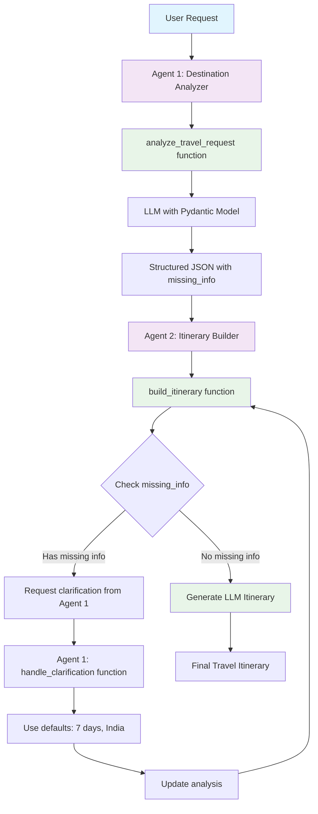

# Multi-Agent Travel Planner System

A **Semantic Kernel** multi-agent system demonstrating plugins, structured output, and intelligent feedback loops.

## 🏗 **1. Creating Kernel with Plugins and Multi-Agent System**

### **Kernel Setup with Plugins:**

```python
# Create kernel and plugins
kernel = Kernel()
destination_analyzer_plugin = DestinationAnalyzerPlugin()
itinerary_builder_plugin = ItineraryBuilderPlugin()

# Register plugins with kernel
kernel.add_plugin(destination_analyzer_plugin, "DestinationAnalyzer")
kernel.add_plugin(itinerary_builder_plugin, "ItineraryBuilder")
```

### **Multi-Agent Definition:**

```python
# Agent 1 kernel with only Destination Analyzer plugin
kernel_analyzer = Kernel()
kernel_analyzer.add_plugin(DestinationAnalyzerPlugin(), "DestinationAnalyzer")

# Agent 2 kernel with only Itinerary Builder plugin
kernel_itinerary = Kernel()
kernel_itinerary.add_plugin(ItineraryBuilderPlugin(), "ItineraryBuilder")

agents = [
    ChatCompletionAgent(
        name="Agent1_DestinationAnalyzer",
        description="Agent 1: Destination Analyzer (GPT-4o-mini)",
        instructions="Use analyze_travel_request and handle_clarification functions",
        service=OpenAIChatCompletion(ai_model_id="gpt-4o-mini"),
        kernel=kernel_analyzer,  # Connect agent to its own kernel
    ),
    ChatCompletionAgent(
        name="Agent2_ItineraryBuilder",
        description="Agent 2: Itinerary Builder (GPT-4o-mini)",
        instructions="Use build_itinerary function and request clarifications",
        service=OpenAIChatCompletion(ai_model_id="gpt-4o-mini"),
        kernel=kernel_itinerary,  # Connect agent to its own kernel
    ),
]
```

### **Group Chat Orchestration:**

```python
group_chat = GroupChatOrchestration(
    members=agents,
    manager=RoundRobinGroupChatManager(max_rounds=5),
)
```

### **Why Separate Kernels per Agent?**

✅ **Best Practice**: Each agent has its own kernel with only its relevant plugins

**Benefits:**

- **Tool Isolation**: Agents only see their own plugins, preventing confusion
- **Memory Separation**: Context and embeddings stay isolated per agent
- **Scalability**: Easy to add new agents without affecting existing ones
- **Clean Architecture**: Clear separation of concerns
- **Future-Proof**: Enables per-agent features like custom embeddings

**Avoid:**
❌ Sharing a single kernel across all agents
❌ All agents seeing all plugins
❌ Potential tool name conflicts
❌ Mixed memory/context between agents

## 🔄 **2. Multi-Agent Flow**



**Key Coordination Rules:**

- **Agent 1** analyzes → returns structured JSON with missing_info
- **Agent 2** detects missing info → requests clarification from Agent 1
- **Agent 1** processes clarifications → uses simple defaults
- **Agent 2** creates final itinerary when all info is complete

## 💬 **3. Group Chat and Agent Interaction in Semantic Kernel**

### **What is Group Chat?**

Group Chat in Semantic Kernel is a **conversation management system** that allows multiple agents to collaborate on a single task. Think of it as a **virtual meeting room** where agents can:

- **Take turns** speaking and contributing
- **Share information** and build on each other's responses
- **Coordinate actions** through structured communication
- **Maintain context** across the entire conversation

### **How Group Chat Works:**

```python
# 1. Create the group chat
group_chat = GroupChatOrchestration(
    members=agents,  # List of agents that can participate
    manager=RoundRobinGroupChatManager(max_rounds=5),  # Controls turn-taking
)

# 2. Start a conversation
result = await group_chat.invoke(
    task="Please help me plan a trip: 'Plan a trip to Japan'",
    runtime=runtime,  # Execution environment
)
```

### **Agent Turn-Taking with RoundRobinGroupChatManager:**

```python
# RoundRobinGroupChatManager controls who speaks when
manager=RoundRobinGroupChatManager(max_rounds=5)

# Turn sequence example:
# Round 1: Agent 1 speaks → Agent 2 speaks
# Round 2: Agent 1 speaks → Agent 2 speaks
# Round 3: Agent 1 speaks → Agent 2 speaks
# ... continues until max_rounds or task completion
```

### **How Agents Interact:**

#### **1. Message Passing:**

```python
# Agent 1 sends message to Agent 2
Agent1: "I analyzed the request. Here's the structured data: {destination: 'Japan', duration: null, missing_info: ['duration']}"

# Agent 2 receives and processes
Agent2: "I see missing duration. Let me request clarification from Agent 1."

# Agent 2 calls Agent 1's function
Agent2: *calls handle_clarification function*

# Agent 1 responds with updated data
Agent1: "Updated analysis: {destination: 'Japan', duration: '7 days', missing_info: []}"
```

#### **2. Function Calling Between Agents:**

```python
# Agent 2 can call Agent 1's functions through the kernel
Agent2: "I need to call Agent 1's handle_clarification function"

# The kernel provides access to all registered functions
kernel.add_plugin(destination_analyzer_plugin, "DestinationAnalyzer")
# Agent 2 can call: DestinationAnalyzer.handle_clarification()
```

#### **3. Context Sharing:**

```python
# All agents share the same conversation context
# Agent 1's analysis is available to Agent 2
# Agent 2's clarification request is available to Agent 1
# The conversation history is maintained throughout the session
```

### **Agent Communication Patterns:**

#### **Pattern 1: Sequential Processing**

```
User Request → Agent 1 (analyzes) → Agent 2 (builds) → Final Result
```

#### **Pattern 2: Feedback Loop**

```
User Request → Agent 1 (analyzes with missing info) → Agent 2 (detects missing info) → Agent 1 (clarifies) → Agent 2 (builds) → Final Result
```

#### **Pattern 3: Collaborative Refinement**

```
User Request → Agent 1 (initial analysis) → Agent 2 (suggests improvements) → Agent 1 (refines) → Agent 2 (final build) → Final Result
```

### **Key Features of Group Chat:**

#### **1. Turn Management:**

- **RoundRobinGroupChatManager**: Ensures fair turn-taking
- **max_rounds**: Prevents infinite loops
- **Automatic handoff**: Agents automatically pass control

#### **2. Context Preservation:**

- **Shared memory**: All agents see the full conversation
- **State tracking**: Previous responses influence future actions
- **Function results**: Output from one agent available to others

#### **3. Error Handling:**

- **Graceful degradation**: If one agent fails, others can continue
- **Retry logic**: Failed operations can be retried
- **Fallback mechanisms**: Alternative paths when primary fails

#### **4. Coordination Control:**

- **Task-level instructions**: Define how agents should coordinate
- **Agent-level instructions**: Define individual agent behavior
- **Function access**: Control which functions agents can call

### **Real Example from Travel Planner:**

```python
# Round 1: Agent 1 analyzes
Agent1: "I analyzed 'Plan a trip to Japan'. Here's my structured analysis:
{
  'destination': 'Japan',
  'duration': null,
  'purpose': 'General Travel',
  'missing_info': ['duration']
}"

# Round 2: Agent 2 detects missing info
Agent2: "I see duration is missing. I need to request clarification from Agent 1."

# Round 3: Agent 2 calls Agent 1's function
Agent2: "Calling DestinationAnalyzer.handle_clarification() with missing duration"

# Round 4: Agent 1 processes clarification
Agent1: "Processing clarification. Using default: 7 days. Updated analysis:
{
  'destination': 'Japan',
  'duration': '7 days',
  'purpose': 'General Travel',
  'missing_info': []
}"

# Round 5: Agent 2 creates itinerary
Agent2: "All info complete. Creating LLM-generated itinerary for Japan..."
```

### **Benefits of Group Chat:**

✅ **Collaborative Problem Solving** - Agents work together to solve complex tasks
✅ **Specialized Expertise** - Each agent focuses on their strengths
✅ **Quality Control** - Multiple agents can validate and improve results
✅ **Flexible Coordination** - Different patterns for different tasks
✅ **Scalable Architecture** - Easy to add more agents

## 🤖 **4. How ChatCompletionAgent Prompts Are Analyzed**

### **The 3 Models in Our Multi-Agent System:**

Our system uses **3 different GPT-4o-mini models** for different purposes:

#### **Model 1: Shared Context Mode (Group Chat Manager)**

```python
# This model manages the overall conversation flow
group_chat = GroupChatOrchestration(
    members=agents,
    manager=RoundRobinGroupChatManager(max_rounds=5),  # Uses GPT-4o-mini internally
)
```

**Purpose:**

- **Orchestrates** which agent speaks when
- **Manages** turn-taking and conversation flow
- **Decides** when to stop the conversation
- **Coordinates** between agents

#### **Model 2: Agent 1 - Destination Analyzer**

```python
ChatCompletionAgent(
    name="Agent1_DestinationAnalyzer",
    service=OpenAIChatCompletion(ai_model_id="gpt-4o-mini"),  # Model 2
    instructions="Use analyze_travel_request and handle_clarification functions",
    kernel=kernel_analyzer,
)
```

**Purpose:**

- **Analyzes** user travel requests
- **Extracts** structured information (destination, duration, purpose)
- **Processes** clarification requests from Agent 2
- **Returns** JSON with missing_info field

#### **Model 3: Agent 2 - Itinerary Builder**

```python
ChatCompletionAgent(
    name="Agent2_ItineraryBuilder",
    service=OpenAIChatCompletion(ai_model_id="gpt-4o-mini"),  # Model 3
    instructions="Use build_itinerary function and request clarifications",
    kernel=kernel_itinerary,
)
```

**Purpose:**

- **Detects** missing information from Agent 1's analysis
- **Requests** clarification when needed
- **Generates** LLM-powered travel itineraries
- **Creates** final travel plans

### **How ChatCompletionAgent Prompt Analysis Works:**

#### **1. Agent-Level Instructions (Permanent Behavior):**

```python
# These instructions define the agent's identity and capabilities
instructions="""You are Agent 1: Destination Analyzer (GPT-4o-mini). Your role is to:

1. **Use the analyze_travel_request function** to extract destination, duration, and purpose
2. **Use the handle_clarification function** ONLY when Agent 2 asks for missing information
3. **DO NOT call handle_clarification directly** - only Agent 2 should request clarifications
4. **DO NOT hallucinate** - if information is missing, indicate it in the missing_info field
5. **Provide structured JSON output** for Agent 2 to process

**IMPORTANT: You MUST use the available functions:**
- Use `analyze_travel_request` to analyze the initial request
- Use `handle_clarification` ONLY when Agent 2 asks for missing info

**Debug Messages**:
- Start with: "🔍 Agent 1: Destination Analyzer (GPT-4o-mini): Extracted [destination, duration, purpose]"
- If asked for clarification: "🔄 Agent 1: Destination Analyzer (GPT-4o-mini): Processing clarification request from Agent 2"
- After user clarification: "✅ Agent 1: Destination Analyzer (GPT-4o-mini): Updated analysis with user clarification"

**Focus on**:
- Destination (where they want to go)
- Duration (how long the trip should be)
- Purpose (why they're traveling - vacation, business, etc.)
- Missing information that needs clarification

**CRITICAL: Do NOT call handle_clarification directly. Only Agent 2 should request clarifications.**

Keep your analysis simple and focused on the essential travel planning elements."""
```

#### **2. Task-Level Instructions (Specific Coordination):**

```python
# These instructions define how agents should coordinate for this specific task
task="""Please help me plan a trip: "Plan a trip to Japan"

**IMPORTANT: Follow the EXACT coordination flow - Agent 1 analyzes, Agent 2 requests clarifications**

**EXACT Step-by-Step Process**:
1. **Agent 1: Destination Analyzer (GPT-4o-mini)**: Use `analyze_travel_request` function to extract destination, duration, and purpose
2. **Agent 2: Itinerary Builder (GPT-4o-mini)**: Use `build_itinerary` function to check if information is missing
3. **If missing info**: Agent 2 will ask Agent 1 for clarification
4. **Agent 1**: If Agent 2 asks for missing info, use `handle_clarification` function to process the clarification
5. **Agent 2**: Create the final itinerary only when all info is complete

**CRITICAL: Use the available functions:**
- Agent 1: Use `analyze_travel_request` and `handle_clarification` functions
- Agent 2: Use `build_itinerary` function

**EXACT Coordination Flow**:
- Agent 1 analyzes the request and returns analysis with missing_info if any
- Agent 2 checks the analysis and requests clarification from Agent 1 if info is missing
- Agent 1 processes the clarification request using `handle_clarification` function ONLY when Agent 2 asks
- Agent 2 creates the final itinerary when all information is complete

**CRITICAL RULES**:
- Agent 1 should NOT call handle_clarification directly
- Agent 1 should NOT hallucinate missing information
- Agent 1 should indicate missing info in the missing_info field
- Agent 2 should request clarification from Agent 1 when info is missing
- Agent 1 should use `handle_clarification` function to process clarification requests
- Only proceed with itinerary creation when all required information is available

**Debug Messages to Show**:
- "🔍 Agent 1: Destination Analyzer (GPT-4o-mini): Extracted [destination, duration, purpose]"
- "❓ Agent 2: Itinerary Builder (GPT-4o-mini): Missing [missing_info], requesting clarification from Agent 1"
- "🔄 Agent 1: Destination Analyzer (GPT-4o-mini): Processing clarification request from Agent 2"
- "✅ Agent 1: Destination Analyzer (GPT-4o-mini): Updated analysis with user clarification"
- "📝 Agent 2: Itinerary Builder (GPT-4o-mini): Creating itinerary with complete information"

**Expected Output**:
- Clear day-by-day travel itinerary with actual content
- Practical activities and recommendations
- Accommodation and transportation tips
- Budget considerations

**CRITICAL: Agent 2 must return the actual itinerary content, not just a message saying the itinerary is ready.**

Keep it simple and practical!"""
```

#### **3. Function-Level Instructions (Plugin Functions):**

```python
# These instructions are embedded in the plugin functions themselves
@kernel_function(
    description="Analyze travel request and extract key information",
    name="analyze_travel_request"
)
async def analyze_travel_request(self, user_request: str) -> str:
    """
    Extract destination, duration, and purpose from travel request using LLM.

    This function uses LLM for natural language understanding to identify:
    - Destination: Where the user wants to travel
    - Duration: How long the trip should be
    - Purpose: Why they're traveling (vacation, business, etc.)

    Args:
        user_request (str): Natural language travel request from user

    Returns:
        str: JSON string containing structured analysis with missing_info field
    """
    # LLM prompt for structured extraction
    prompt = f"""
    Analyze this travel request and extract key information: "{user_request}"

    Extract the following information:
    1. **Destination**: Where they want to travel (city, country, region)
    2. **Duration**: How long the trip should be (e.g., "7 days", "2 weeks", "1 month")
    3. **Purpose**: Why they're traveling (e.g., "vacation", "business", "cherry blossom viewing", "beach vacation")

    Return ONLY a valid JSON object with these fields:
    - destination: string (use "Unknown" if not found)
    - duration: string (use null if not found)
    - purpose: string (default to "General Travel" if not specified)
    - missing_info: array of strings (list what's missing: "destination", "duration", etc.)

    Examples:
    - "Plan a trip to Japan for cherry blossoms" → {{"destination": "Japan", "duration": null, "purpose": "Cherry Blossom Viewing", "missing_info": ["duration"]}}
    - "I want to visit Paris for 5 days" → {{"destination": "Paris", "duration": "5 days", "purpose": "General Travel", "missing_info": []}}
    - "Plan a beach vacation in Bali" → {{"destination": "Bali", "duration": null, "purpose": "Beach Vacation", "missing_info": ["duration"]}}

    Return ONLY the JSON, no other text.
    """
```

### **Prompt Analysis Flow:**

#### **Step 1: Agent Initialization**

```python
# Each agent gets its instructions during creation
ChatCompletionAgent(
    instructions="Agent-level instructions define permanent behavior",
    # These instructions become part of the agent's identity
)
```

#### **Step 2: Task Assignment**

```python
# When a task is assigned, task-level instructions are added
await group_chat.invoke(
    task="Task-level instructions define specific coordination",
    # These instructions override or supplement agent-level instructions
)
```

#### **Step 3: Function Execution**

```python
# When agents call functions, function-level instructions are used
@kernel_function(description="Function-level instructions")
async def analyze_travel_request(self, user_request: str) -> str:
    # Function-specific prompts and logic
```

### **The 3 Models Work Together:**

```
User Request
    ↓
Model 1 (Group Chat Manager): "Which agent should speak next?"
    ↓
Model 2 (Agent 1): "I'll analyze this request using my functions"
    ↓
Model 2 calls: analyze_travel_request() with function-level prompt
    ↓
Model 1: "Agent 2 should speak next"
    ↓
Model 3 (Agent 2): "I'll check for missing info and create itinerary"
    ↓
Model 3 calls: build_itinerary() with function-level prompt
    ↓
Final Result
```

### **Key Insights:**

✅ **Each model has a specific role** - No overlap in responsibilities
✅ **Instructions are layered** - Agent-level + Task-level + Function-level
✅ **Context is shared** - All models see the conversation history
✅ **Functions are isolated** - Each agent only sees its own functions
✅ **Coordination is explicit** - Clear rules for how agents work together

## 🤖 **5. Agents, Plugins, and Tools**

### **Agent 1: Destination Analyzer**

**Role:** Extract structured travel information using LLM with Pydantic models.

**Plugin:** `DestinationAnalyzerPlugin`

**Functions:**

```python
@kernel_function
async def analyze_travel_request(self, user_request: str) -> str:
    # LLM-powered extraction with structured output
    # Returns JSON with destination, duration, purpose, missing_info
    return json.dumps(analysis)

@kernel_function
def handle_clarification(self, original_analysis: str, user_clarification: str) -> str:
    # Use simple defaults for missing information
    # Duration missing → "7 days"
    # Destination missing → "India"
    return json.dumps(updated_analysis)
```

**Features:**

- ✅ **LLM-Powered Analysis** - Uses GPT-4o-mini for natural language understanding
- ✅ **Structured Output** - Pydantic TravelAnalysis model ensures valid responses
- ✅ **Type Safety** - Compile-time validation of data structures
- ✅ **Simple Default Processing** - Uses fixed defaults for missing information
- ✅ **Anti-Hallucination** - Never guesses missing information

### **Agent 2: Itinerary Builder**

**Role:** Generate comprehensive travel itineraries based on analyzed data.

**Plugin:** `ItineraryBuilderPlugin`

**Functions:**

```python
@kernel_function
async def build_itinerary(self, analysis: str) -> str:
    # Check for missing info
    # Request clarification if needed
    # Generate LLM-powered itinerary
    return itinerary_text

def _request_clarification(self, missing_info: List[str]) -> str:
    # Create clarification request JSON
    return json.dumps(clarification_request)

async def _generate_general_itinerary(self, destination: str, duration: str, purpose: str) -> str:
    # LLM-powered itinerary generation
    # Dynamic, destination-specific content
    return llm_generated_itinerary
```

**Features:**

- ✅ **LLM-Driven Content** - Dynamic itineraries for any destination
- ✅ **Missing Info Detection** - Checks missing_info field from Agent 1
- ✅ **Quality Control** - Only creates itineraries with complete information
- ✅ **Practical Details** - Accommodation, transportation, and budget tips

### **Structured Output with Pydantic:**

```python
class TravelAnalysis(KernelBaseModel):
    destination: str
    duration: str | None
    purpose: str
    missing_info: List[str]

# LLM settings with structured output
settings = OpenAIPromptExecutionSettings(
    max_tokens=200,
    temperature=0.1,
    response_format=TravelAnalysis  # Use Pydantic model
)
```

## 🚀 **Quick Start**

```bash
# Setup
python -m venv venv
source venv/bin/activate
pip install -r requirements.txt

# Environment
cp .env.example .env
# Add your OPENAI_API_KEY

# Run
python travel_planner.py
```

## 📋 **Example Usage**

```bash
✈️ Your travel request: Plan a trip to Japan for cherry blossoms
🔄 Planning your trip...
✅ Travel planning completed!
```

**Sample Requests:**

- `"Plan a trip to Japan for cherry blossoms."`
- `"I want to visit Paris for 5 days."`
- `"Plan a beach vacation in Bali."`

## 🛠 **Dependencies**

```
python-dotenv==1.0.0
semantic-kernel>=1.35.0
```

---

**Perfect for learning Semantic Kernel multi-agent systems!** 🎯
