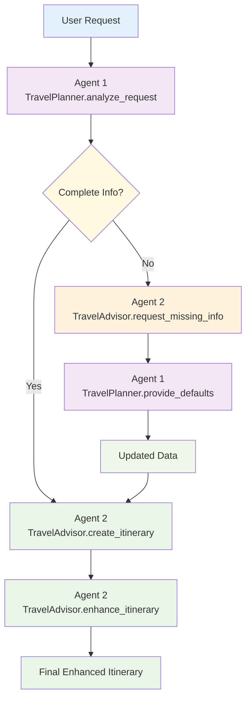

# Multi-Agent Travel Planner with Semantic Kernel Plugins

A sophisticated multi-agent system demonstrating **proper Semantic Kernel plugin architecture** with **function calling** for reliable agent-to-agent communication.

## Project Structure

```
multi-agent/
├── README.md                    # Project documentation and guide
├── travel_planner.py            # Main multi-agent implementation
├── requirements.txt              # Python dependencies
├── activate.sh                   # Environment setup script
├── agent_interactions.log        # Detailed agent interaction logs
├── venv/                        # Python virtual environment
├── .env                         # Environment variables (create this)
└── .gitignore                   # Git ignore rules
```

### Dependencies

```txt
semantic-kernel[all]>=1.35.0  # Microsoft Semantic Kernel with all features
python-dotenv>=1.1.1          # Environment variable management
```

### Key Files

| File                         | Purpose                                                                      |
| ---------------------------- | ---------------------------------------------------------------------------- |
| **`travel_planner.py`**      | Main implementation with Agent 1 (TravelPlanner) and Agent 2 (TravelAdvisor) |
| **`requirements.txt`**       | Python dependencies                                                          |
| **`activate.sh`**            | Setup script that creates venv, installs dependencies, and validates .env    |
| **`agent_interactions.log`** | Detailed logs of all agent interactions and function calls                   |
| **`.env`**                   | Environment file for your OpenAI API key (create this file)                  |

## System Overview

This implementation demonstrates modern Semantic Kernel plugins for multi-agent workflows:

- **Agent 1 - TravelPlanner Plugin**: Analyzes travel requests and provides default values
- **Agent 2 - TravelAdvisor Plugin**: Creates and enhances detailed itineraries
- **Function Calling**: Uses structured function calls for reliable agent communication
- **Pydantic Models**: Ensures type-safe, structured data flow

## Plugin Architecture

### Agent Functions

| Agent       | Plugin            | Function               | Purpose                                                 |
| ----------- | ----------------- | ---------------------- | ------------------------------------------------------- |
| **Agent 1** | **TravelPlanner** | `analyze_request`      | Analyzes user input and returns structured JSON         |
| **Agent 1** | **TravelPlanner** | `provide_defaults`     | Provides default values for missing information         |
| **Agent 2** | **TravelAdvisor** | `create_itinerary`     | Creates detailed travel itineraries from JSON           |
| **Agent 2** | **TravelAdvisor** | `request_missing_info` | Requests missing info using structured function calling |
| **Agent 2** | **TravelAdvisor** | `enhance_itinerary`    | Enhances itineraries with additional details            |

## Workflow



## Function Calling and Pydantic

### Function Calling

Function calling uses structured data for reliable agent-to-agent communication:

```python
# Reliable structured data checking
if travel_data.get("missing_info") and len(travel_data["missing_info"]) > 0:
    request_result = await kernel.invoke(
        plugin_name="TravelAdvisor",
        function_name="request_missing_info",
        input=missing_info_input
    )
```

### Pydantic Models with KernelBaseModel

The system uses **Pydantic models** with Semantic Kernel's `KernelBaseModel` for type-safe communication:

```python
class TravelAnalysis(KernelBaseModel):
    destination: str = Field(description="The destination for the trip")
    duration: Optional[str] = Field(default=None, description="Duration of the trip")
    purpose: str = Field(description="The main purpose of the trip")
    missing_info: List[str] = Field(default_factory=list, description="List of missing information")

class DefaultValues(KernelBaseModel):
    duration: Optional[str] = Field(default="7 days", description="Default duration")
    budget: Optional[str] = Field(default="moderate", description="Default budget level")
    accommodation: Optional[str] = Field(default="hotel", description="Default accommodation")
    transportation: Optional[str] = Field(default="public transport", description="Default transportation")
```

#### What is KernelBaseModel?

`KernelBaseModel` is Semantic Kernel's extension of Pydantic's `BaseModel` that provides:

1. **Structured Output**: Enforces JSON schema compliance for AI model responses
2. **Type Safety**: Ensures data types match expected structure
3. **Validation**: Automatically validates required fields and data types
4. **Integration**: Seamlessly works with Semantic Kernel's function calling
5. **Error Handling**: Provides clear error messages for invalid data

#### How KernelBaseModel Works

```python
# Define structured output model
class TravelAnalysis(KernelBaseModel):
    destination: str = Field(description="The destination for the trip")
    duration: Optional[str] = Field(default=None, description="Duration of the trip")
    purpose: str = Field(description="The main purpose of the trip")
    missing_info: List[str] = Field(default_factory=list, description="List of missing information")

# Configure function to use structured output
analyze_request_function = KernelFunctionFromPrompt(
    function_name="analyze_request",
    prompt=analyze_request_prompt,
    description="Agent 1: Analyzes travel requests and returns structured JSON data",
    prompt_execution_settings={
        "response_format": TravelAnalysis,  # Enforces JSON schema
        "temperature": 0.1
    }
)

# AI model response is automatically validated and converted to TravelAnalysis object
result = await kernel.invoke("TravelPlanner", "analyze_request", input=user_request)
travel_data = result.value[0].content  # Already a TravelAnalysis object
```

### Benefits

1. **Reliability**: Structured data ensures consistent communication
2. **Type Safety**: Pydantic models ensure data consistency
3. **Better Error Handling**: Proper validation and error messages
4. **Scalability**: Easy to add new functions and models
5. **Debugging**: Clear logging of structured data flow
6. **Modern**: Uses OpenAI's native function calling capabilities

## Implementation

### Core Components

```python
# Kernel setup with OpenAI service
kernel = Kernel()
kernel.add_service(OpenAIChatCompletion(ai_model_id="gpt-4o-mini"))

# Create plugins
travel_planner_plugin = create_travel_planner_plugin(kernel)
travel_advisor_plugin = create_travel_advisor_plugin(kernel)

# Add plugins to kernel
kernel.add_plugin(travel_planner_plugin)
kernel.add_plugin(travel_advisor_plugin)
```

### Agent Communication

```python
# Agent 1 analyzes request
planner_result = await kernel.invoke("TravelPlanner", "analyze_request", input=user_request)

# Agent 2 creates itinerary
advisor_result = await kernel.invoke("TravelAdvisor", "create_itinerary", input=json_response)

# Agent 2 requests missing info from Agent 1
request_result = await kernel.invoke("TravelAdvisor", "request_missing_info", input=missing_items)

# Agent 1 provides defaults
defaults_result = await kernel.invoke("TravelPlanner", "provide_defaults", input=query)

# Agent 2 enhances itinerary
enhanced_result = await kernel.invoke("TravelAdvisor", "enhance_itinerary", input=final_response)
```

## Usage

### Quick Start

```bash
# Option 1: Use the setup script
./activate.sh
python3 travel_planner.py

# Option 2: Manual setup
source venv/bin/activate
pip install -r requirements.txt
python3 travel_planner.py
```

### Example Interactions

**Request with missing duration:**

```
Your travel request: Plan a trip to Japan for cherry blossoms

[AGENT 1] TravelPlanner.analyze_request: Extracts structured JSON with missing duration
[AGENT 2] TravelAdvisor.create_itinerary: Detects missing info using structured data
[AGENT 2] TravelAdvisor.request_missing_info: Uses structured function calling to request missing info
[AGENT 1] TravelPlanner.provide_defaults: Provides structured default "7 days"
[AGENT 2] TravelAdvisor.create_itinerary: Creates itinerary with 7-day duration
[AGENT 2] TravelAdvisor.enhance_itinerary: Enhances with specific details
```

**Request with complete info:**

```
Your travel request: Plan a 5-day trip to Paris

[AGENT 1] TravelPlanner.analyze_request: Extracts complete structured JSON
[AGENT 2] TravelAdvisor.create_itinerary: Creates itinerary directly with structured data
[AGENT 2] TravelAdvisor.enhance_itinerary: Enhances with specific details
```

## Key Features

### 1. **Modern Function Calling**

- Uses OpenAI's native function calling for reliable agent communication
- Structured models ensure reliable data flow
- Type-safe communication between agents

### 2. **Proper Plugin Organization**

- Functions grouped by domain/functionality
- Clear namespace separation (`TravelPlanner.analyze_request`)
- Easy to add new functions to existing plugins

### 3. **Intelligent Default Handling**

- Automatically provides sensible defaults when missing
- Maintains conversation flow without user interruption
- Preserves original request context

### 4. **Structured Data Flow**

- Agent 1: `User Request` → `Structured JSON with missing_info`
- Agent 2: `Structured JSON` → `Itinerary OR Structured Request`
- Agent 1: `Structured Query` → `Structured Default Values`
- Agent 2: `Enhanced Itinerary`

### 5. **Comprehensive Error Handling**

- Structured validation at each step
- Graceful fallback for parsing errors
- Comprehensive debug logging with agent identification

## Learning Outcomes

### Semantic Kernel Plugin Concepts

1. **KernelPlugin**: Organizing functions into logical groups with structured models
2. **Plugin Namespaces**: Using `PluginName.function_name` for invocation
3. **Plugin Registration**: Adding plugins to kernel with `kernel.add_plugin()`
4. **Plugin Communication**: Inter-plugin function calls using structured models
5. **Plugin Scalability**: Adding new functions to existing plugins

### Multi-Agent Patterns

1. **Structured Function Calling**: Using OpenAI's native function calling
2. **Default Value Provision**: Automatic handling of missing information
3. **State Management**: Updating structured JSON data between plugin functions
4. **Error Recovery**: Graceful handling of structured validation failures

## References

- [Microsoft Semantic Kernel](https://github.com/microsoft/semantic-kernel)
- [KernelPlugin Documentation](https://learn.microsoft.com/en-us/semantic-kernel/agents/using-the-sdk/plugins)
- [OpenAI Function Calling](https://platform.openai.com/docs/guides/function-calling)

---

**Note**: This implementation demonstrates the **modern way** to use Microsoft Semantic Kernel plugins for multi-agent communication patterns with function calling, following current best practices and ensuring reliable, scalable agent interactions.
