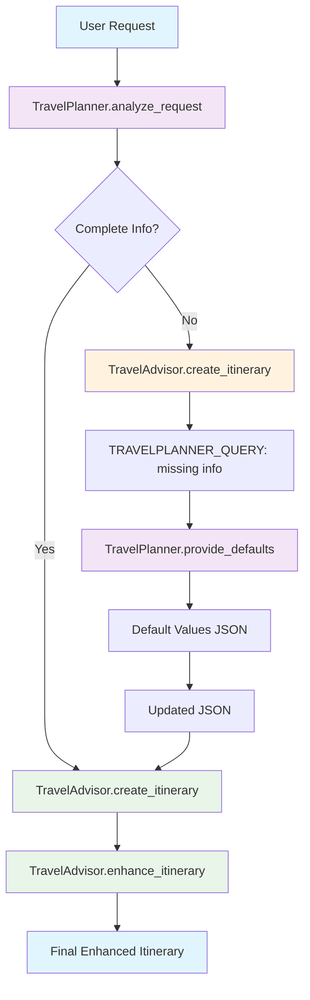

# Multi-Agent Travel Planner with Semantic Kernel Plugins

A sophisticated multi-agent system demonstrating **proper Semantic Kernel plugin architecture** for agent-to-agent communication. This implementation uses Microsoft Semantic Kernel's `KernelPlugin` to organize related functions into logical groups.

## 🎯 System Overview

This implementation demonstrates the **correct way** to use Semantic Kernel plugins for multi-agent workflows:

- **TravelPlanner Plugin**: Contains functions for analyzing travel requests and providing defaults
- **TravelAdvisor Plugin**: Contains functions for creating and enhancing itineraries
- **Proper namespace separation**: `TravelPlanner.analyze_request`, `TravelAdvisor.create_itinerary`

## 🤖 Plugin Architecture

### Plugin Structure

```python
# TravelPlanner Plugin
travel_planner_plugin = KernelPlugin(
    name="TravelPlanner",
    description="Plugin for analyzing travel requests and providing default values",
    functions=[
        analyze_request_function,      # TravelPlanner.analyze_request
        provide_defaults_function     # TravelPlanner.provide_defaults
    ]
)

# TravelAdvisor Plugin
travel_advisor_plugin = KernelPlugin(
    name="TravelAdvisor",
    description="Plugin for creating and enhancing travel itineraries",
    functions=[
        create_itinerary_function,    # TravelAdvisor.create_itinerary
        enhance_itinerary_function    # TravelAdvisor.enhance_itinerary
    ]
)
```

### Agent Functions by Plugin

| Plugin            | Function            | Purpose                                         |
| ----------------- | ------------------- | ----------------------------------------------- |
| **TravelPlanner** | `analyze_request`   | Analyzes user input and returns structured JSON |
| **TravelPlanner** | `provide_defaults`  | Provides default values for missing information |
| **TravelAdvisor** | `create_itinerary`  | Creates detailed travel itineraries from JSON   |
| **TravelAdvisor** | `enhance_itinerary` | Enhances itineraries with additional details    |

## 🔄 Workflow Diagram



## 🤖 Agent-to-Agent Communication in Semantic Kernel

### How Plugin Communication Works

Semantic Kernel enables **plugin-to-plugin communication** through a sophisticated orchestration system. Here's how agents "talk" to each other:

#### 1. **Plugin Registration & Discovery**

```python
# Plugins are registered with the kernel
kernel.add_plugin(travel_planner_plugin)
kernel.add_plugin(travel_advisor_plugin)

# Kernel maintains a registry of all available functions
# TravelPlanner.analyze_request
# TravelPlanner.provide_defaults
# TravelAdvisor.create_itinerary
# TravelAdvisor.enhance_itinerary
```

#### 2. **Function Invocation with Namespaces**

```python
# Each plugin function is invoked using namespace syntax
await kernel.invoke(plugin_name="TravelPlanner", function_name="analyze_request", input=user_request)
await kernel.invoke(plugin_name="TravelAdvisor", function_name="create_itinerary", input=json_data)
```

#### 3. **Inter-Plugin Communication Protocol**

```python
# TravelAdvisor can "ask" TravelPlanner for missing information
if advisor_response.startswith("TRAVELPLANNER_QUERY:"):
    # Extract the query
    query = advisor_response.replace("TRAVELPLANNER_QUERY:", "").strip()

    # Invoke TravelPlanner's provide_defaults function
    defaults_result = await kernel.invoke(
        plugin_name="TravelPlanner",
        function_name="provide_defaults",
        input=query
    )
```

### Communication Patterns

#### **Pattern 1: Sequential Processing**

```python
# Agent 1 → Agent 2 → Agent 1 → Agent 2
step1 = await kernel.invoke("TravelPlanner", "analyze_request", input=request)
step2 = await kernel.invoke("TravelAdvisor", "create_itinerary", input=step1_result)
step3 = await kernel.invoke("TravelPlanner", "provide_defaults", input=step2_query)
step4 = await kernel.invoke("TravelAdvisor", "enhance_itinerary", input=step3_result)
```

#### **Pattern 2: Conditional Communication**

```python
# Agent 2 decides whether to ask Agent 1 for help
if missing_info_detected:
    # Ask Agent 1 for defaults
    query = f"TRAVELPLANNER_QUERY: {missing_items}"
else:
    # Process directly
    result = process_complete_data()
```

#### **Pattern 3: State Management**

```python
# Agents share state through JSON data
travel_data = {
    "destination": "Japan",
    "duration": None,
    "missing_info": ["duration"]
}

# Agent 1 updates the state
travel_data["duration"] = "7 days"
travel_data["missing_info"].remove("duration")

# Agent 2 receives updated state
updated_json = json.dumps(travel_data)
```

### Logic Flow Explanation

#### **Step 1: Request Analysis (TravelPlanner.analyze_request)**

```python
# Input: "Plan a trip to Japan for cherry blossoms"
# Logic: Extract structured information
# Output: JSON with missing_info array
{
    "destination": "Japan",
    "duration": null,
    "purpose": "cherry blossoms",
    "missing_info": ["duration"]
}
```

#### **Step 2: Itinerary Creation (TravelAdvisor.create_itinerary)**

```python
# Input: JSON from TravelPlanner
# Logic: Check if complete information available
if "missing_info" in data and len(data["missing_info"]) > 0:
    # Ask TravelPlanner for missing info
    return f"TRAVELPLANNER_QUERY: {data['missing_info']}"
else:
    # Create complete itinerary
    return detailed_itinerary
```

#### **Step 3: Default Provision (TravelPlanner.provide_defaults)**

```python
# Input: Query from TravelAdvisor ("duration")
# Logic: Provide sensible defaults
# Output: JSON with default values
{
    "defaults": {
        "duration": "7 days",
        "budget": "moderate",
        "accommodation": "hotel"
    }
}
```

#### **Step 4: State Update & Final Processing**

```python
# Logic: Merge defaults with original data
travel_data.update(defaults_data["defaults"])

# Logic: Remove resolved missing_info items
for resolved_item in defaults_data["defaults"]:
    if resolved_item in travel_data["missing_info"]:
        travel_data["missing_info"].remove(resolved_item)
```

#### **Step 5: Enhancement (TravelAdvisor.enhance_itinerary)**

```python
# Input: Complete itinerary from previous step
# Logic: Add specific details, locations, costs
# Output: Enhanced itinerary with practical details
```

### Communication Protocols

#### **Protocol 1: Query-Response Pattern**

```python
# TravelAdvisor → TravelPlanner
query = "TRAVELPLANNER_QUERY: duration, budget"

# TravelPlanner → TravelAdvisor
response = {
    "defaults": {
        "duration": "7 days",
        "budget": "moderate"
    }
}
```

#### **Protocol 2: State Update Pattern**

```python
# Original state
state = {"duration": null, "missing_info": ["duration"]}

# After TravelPlanner intervention
state = {"duration": "7 days", "missing_info": []}
```

#### **Protocol 3: Error Handling Pattern**

```python
# If TravelPlanner returns invalid JSON
try:
    defaults_data = json.loads(response)
except json.JSONDecodeError:
    return "❌ Error: Invalid response from TravelPlanner"
```

### Memory and Context Management

#### **Plugin-Level Memory**

```python
# Each plugin maintains its own context
travel_planner_plugin = KernelPlugin(
    name="TravelPlanner",
    functions=[analyze_request_function, provide_defaults_function]
)

# Functions within the same plugin can share context
```

#### **Kernel-Level State Management**

```python
# Kernel orchestrates the overall workflow
kernel = Kernel()
kernel.add_plugin(travel_planner_plugin)
kernel.add_plugin(travel_advisor_plugin)

# Kernel maintains the conversation state
conversation_state = {
    "current_step": "analyzing_request",
    "travel_data": {...},
    "plugin_history": [...]
}
```

#### **Function-Level Context**

```python
# Each function invocation maintains its own context
async def analyze_request(input_text: str) -> str:
    # Function has access to:
    # - Input parameters
    # - Plugin context
    # - Kernel services (OpenAI)
    # - Previous function results
    pass
```

### Error Handling and Recovery

#### **Plugin Communication Errors**

```python
# Handle plugin invocation failures
try:
    result = await kernel.invoke("TravelPlanner", "analyze_request", input=request)
except Exception as e:
    # Fallback to basic processing
    return basic_response(request)
```

#### **JSON Parsing Errors**

```python
# Handle malformed responses between plugins
try:
    data = json.loads(plugin_response)
except json.JSONDecodeError:
    # Clean up markdown formatting
    cleaned_response = remove_markdown(plugin_response)
    data = json.loads(cleaned_response)
```

#### **Missing Information Recovery**

```python
# If TravelAdvisor can't get defaults from TravelPlanner
if defaults_response.startswith("❌ Error"):
    # Use hardcoded defaults
    defaults = {"duration": "7 days", "budget": "moderate"}
```

### Performance and Scalability

#### **Parallel Processing Potential**

```python
# Future enhancement: Parallel plugin execution
async def parallel_workflow():
    # Execute multiple plugins simultaneously
    tasks = [
        kernel.invoke("TravelPlanner", "analyze_request", input=request),
        kernel.invoke("WeatherPlugin", "get_forecast", input=destination),
        kernel.invoke("CurrencyPlugin", "get_rates", input=destination)
    ]
    results = await asyncio.gather(*tasks)
```

#### **Plugin Composition**

```python
# Plugins can be composed for complex workflows
composite_plugin = KernelPlugin(
    name="TravelOrchestrator",
    functions=[
        travel_planner_functions,
        travel_advisor_functions,
        weather_functions,
        currency_functions
    ]
)
```

## 🧠 Decision-Making Logic in Multi-Agent Systems

### How Agents Make Decisions

#### **1. Information Gathering Phase**

```python
# TravelPlanner analyzes user input
def analyze_request(user_input: str) -> dict:
    # Decision logic:
    # 1. Extract destination (required)
    # 2. Extract duration (optional)
    # 3. Extract purpose (required)
    # 4. Identify missing critical information

    missing_info = []
    if not duration:
        missing_info.append("duration")
    if not budget:
        missing_info.append("budget")

    return {
        "destination": extracted_destination,
        "duration": duration or None,
        "purpose": extracted_purpose,
        "missing_info": missing_info
    }
```

#### **2. Decision Tree Logic**

```python
# TravelAdvisor makes decisions based on data completeness
def create_itinerary(travel_data: dict) -> str:
    # Decision tree:
    if travel_data["missing_info"]:
        # Path A: Ask for missing information
        return f"TRAVELPLANNER_QUERY: {travel_data['missing_info']}"
    else:
        # Path B: Create complete itinerary
        return create_detailed_itinerary(travel_data)
```

#### **3. Default Value Logic**

```python
# TravelPlanner provides intelligent defaults
def provide_defaults(query: str) -> dict:
    # Decision logic based on query:
    if "duration" in query:
        # Context-aware duration defaults
        if "cherry blossoms" in context:
            return {"duration": "7 days"}  # Optimal for cherry blossoms
        elif "business" in context:
            return {"duration": "3 days"}  # Shorter for business
        else:
            return {"duration": "5 days"}  # General default

    if "budget" in query:
        return {"budget": "moderate"}  # Safe default

    return {"duration": "7 days", "budget": "moderate"}
```

### Logic Flow Examples

#### **Example 1: Complete Information**

```python
# User: "Plan a 5-day trip to Paris"
# TravelPlanner.analyze_request:
{
    "destination": "Paris",
    "duration": "5 days",
    "purpose": "tourism",
    "missing_info": []  # No missing info
}

# TravelAdvisor.create_itinerary:
# Decision: missing_info is empty → Create itinerary directly
# Result: Detailed 5-day Paris itinerary
```

#### **Example 2: Missing Information**

```python
# User: "Plan a trip to Japan for cherry blossoms"
# TravelPlanner.analyze_request:
{
    "destination": "Japan",
    "duration": null,
    "purpose": "cherry blossoms",
    "missing_info": ["duration"]  # Missing duration
}

# TravelAdvisor.create_itinerary:
# Decision: missing_info contains "duration" → Ask TravelPlanner
# Result: "TRAVELPLANNER_QUERY: duration"

# TravelPlanner.provide_defaults:
# Decision: "duration" in query + "cherry blossoms" context
# Result: {"duration": "7 days"}  # Optimal for cherry blossoms

# TravelAdvisor.create_itinerary (second call):
# Decision: Now has complete info → Create itinerary
# Result: Detailed 7-day Japan cherry blossom itinerary
```

#### **Example 3: Complex Decision Making**

```python
# User: "I want to visit Bali"
# TravelPlanner.analyze_request:
{
    "destination": "Bali",
    "duration": null,
    "purpose": "vacation",
    "missing_info": ["duration", "budget", "accommodation"]
}

# TravelAdvisor.create_itinerary:
# Decision: Multiple missing items → Ask for all
# Result: "TRAVELPLANNER_QUERY: duration, budget, accommodation"

# TravelPlanner.provide_defaults:
# Decision: Multiple items + "Bali" + "vacation" context
# Result: {
#     "duration": "10 days",      # Longer for Bali vacation
#     "budget": "moderate",       # Safe default
#     "accommodation": "resort"   # Bali-specific default
# }
```

### Context-Aware Decision Making

#### **Destination-Based Logic**

```python
def get_destination_specific_defaults(destination: str, purpose: str) -> dict:
    if destination == "Japan":
        if purpose == "cherry blossoms":
            return {"duration": "7 days", "best_time": "March-April"}
        elif purpose == "business":
            return {"duration": "3 days", "accommodation": "business_hotel"}

    elif destination == "Bali":
        return {"duration": "10 days", "accommodation": "resort"}

    elif destination == "Paris":
        return {"duration": "5 days", "accommodation": "hotel"}

    else:
        return {"duration": "7 days", "accommodation": "hotel"}
```

#### **Purpose-Based Logic**

```python
def get_purpose_specific_recommendations(purpose: str) -> dict:
    if purpose == "business":
        return {
            "transportation": "efficient_public_transport",
            "accommodation": "business_hotel",
            "activities": "minimal_leisure"
        }
    elif purpose == "romance":
        return {
            "accommodation": "romantic_hotel",
            "activities": "romantic_experiences",
            "budget": "luxury"
        }
    elif purpose == "adventure":
        return {
            "activities": "adventure_sports",
            "accommodation": "adventure_lodge",
            "budget": "moderate"
        }
```

### Error Recovery Logic

#### **Graceful Degradation**

```python
def handle_plugin_failure(failed_plugin: str, context: dict) -> dict:
    if failed_plugin == "TravelPlanner":
        # Fallback to hardcoded defaults
        return {
            "duration": "7 days",
            "budget": "moderate",
            "accommodation": "hotel"
        }

    elif failed_plugin == "TravelAdvisor":
        # Fallback to basic itinerary
        return create_basic_itinerary(context)
```

#### **Retry Logic**

```python
async def invoke_with_retry(plugin_name: str, function_name: str, input_data: str, max_retries: int = 3):
    for attempt in range(max_retries):
        try:
            result = await kernel.invoke(plugin_name, function_name, input=input_data)
            return result
        except Exception as e:
            if attempt == max_retries - 1:
                # Last attempt failed, use fallback
                return fallback_response(input_data)
            else:
                # Wait before retry
                await asyncio.sleep(1)
```

### Learning and Adaptation

#### **Plugin Performance Tracking**

```python
class PluginPerformanceTracker:
    def __init__(self):
        self.success_rates = {}
        self.response_times = {}
        self.error_counts = {}

    def record_invocation(self, plugin_name: str, function_name: str, success: bool, response_time: float):
        key = f"{plugin_name}.{function_name}"
        if key not in self.success_rates:
            self.success_rates[key] = []

        self.success_rates[key].append(success)
        self.response_times[key] = response_time
```

#### **Adaptive Decision Making**

```python
def adaptive_default_selection(context: dict, performance_history: dict) -> dict:
    # Use performance history to make better decisions
    if performance_history.get("TravelPlanner.provide_defaults", {}).get("success_rate", 0) < 0.8:
        # TravelPlanner is unreliable, use conservative defaults
        return {"duration": "5 days", "budget": "budget"}
    else:
        # TravelPlanner is reliable, use optimal defaults
        return get_optimal_defaults(context)
```

## 🏗️ Semantic Kernel Plugin Implementation

### Core Components

```python
# Kernel setup with OpenAI service
kernel = Kernel()
kernel.add_service(OpenAIChatCompletion(ai_model_id="gpt-4o-mini"))

# Create plugins
travel_planner_plugin = create_travel_planner_plugin(kernel)
travel_advisor_plugin = create_travel_advisor_plugin(kernel)

# Add plugins to kernel
kernel.add_plugin(travel_planner_plugin)
kernel.add_plugin(travel_advisor_plugin)
```

### Plugin-to-Plugin Communication

```python
# TravelAdvisor asks TravelPlanner for missing info
if advisor_response.startswith("TRAVELPLANNER_QUERY:"):
    query = advisor_response.replace("TRAVELPLANNER_QUERY:", "").strip()

    # TravelPlanner provides defaults
    defaults_result = await kernel.invoke("TravelPlanner", "provide_defaults", input=query)
    defaults_response = defaults_result.value[0].content

    # Update travel data with defaults
    travel_data["duration"] = defaults_data["defaults"]["duration"]
```

### Function Invocation with Namespaces

```python
# Step 1: TravelPlanner.analyze_request
planner_result = await kernel.invoke("TravelPlanner", "analyze_request", input=user_request)

# Step 2: TravelAdvisor.create_itinerary
advisor_result = await kernel.invoke("TravelAdvisor", "create_itinerary", input=json_response)

# Step 3: TravelPlanner.provide_defaults (if needed)
defaults_result = await kernel.invoke("TravelPlanner", "provide_defaults", input=query)

# Step 4: TravelAdvisor.enhance_itinerary
enhanced_result = await kernel.invoke("TravelAdvisor", "enhance_itinerary", input=final_response)
```

## 🚀 Usage

### Quick Start

```bash
# Setup environment
source venv/bin/activate
python3 travel_planner_with_plugins.py
```

### Example Interactions

**Request with missing duration:**

```
✈️ Your travel request: Plan a trip to Japan for cherry blossoms

🤖 TravelPlanner.analyze_request: Extracts JSON with missing duration
🤖 TravelAdvisor.create_itinerary: Requests missing info from TravelPlanner
🤖 TravelPlanner.provide_defaults: Provides default "7 days"
🤖 TravelAdvisor.create_itinerary: Creates itinerary with 7-day duration
🤖 TravelAdvisor.enhance_itinerary: Enhances with specific details
```

**Request with complete info:**

```
✈️ Your travel request: Plan a 5-day trip to Paris

🤖 TravelPlanner.analyze_request: Extracts complete JSON
🤖 TravelAdvisor.create_itinerary: Creates itinerary directly
🤖 TravelAdvisor.enhance_itinerary: Enhances with specific details
```

## 📊 Key Features

### 1. **Proper Plugin Organization**

- Functions grouped by domain/functionality
- Clear namespace separation (`TravelPlanner.analyze_request`)
- Easy to add new functions to existing plugins
- Better scalability for complex systems

### 2. **Intelligent Default Handling**

- Automatically provides 7-day duration when missing
- Maintains conversation flow without user interruption
- Preserves original request context

### 3. **Structured Data Flow**

- TravelPlanner: `User Request` → `JSON with missing_info`
- TravelAdvisor: `JSON` → `Itinerary OR TRAVELPLANNER_QUERY`
- TravelPlanner: `Query` → `Default Values JSON`
- TravelAdvisor: `Enhanced Itinerary`

### 4. **Error Handling**

- JSON validation at each step
- Graceful fallback for parsing errors
- Comprehensive debug logging

## 🔧 Technical Details

### File Structure

```
travel_planner_with_plugins.py       # Main plugin-based implementation
├── create_travel_planner_plugin()   # Creates TravelPlanner plugin
├── create_travel_advisor_plugin()   # Creates TravelAdvisor plugin
├── run_multi_agent_workflow_with_plugins() # Plugin orchestration
└── interactive_demo_session_with_plugins() # Interactive demo
```

### Plugin Function Details

#### TravelPlanner Plugin Functions

**`analyze_request`:**

- Analyzes natural language travel requests
- Extracts structured JSON data
- Identifies missing information
- Returns: `{"destination": "...", "duration": "...", "purpose": "...", "missing_info": [...]}`

**`provide_defaults`:**

- Provides sensible default values for missing information
- Handles duration, budget, accommodation, transportation
- Returns: `{"defaults": {"duration": "7 days", "budget": "moderate", ...}}`

#### TravelAdvisor Plugin Functions

**`create_itinerary`:**

- Creates detailed travel itineraries from JSON data
- Includes attractions, accommodation, transportation tips
- Requests missing info from TravelPlanner if needed
- Returns: Detailed itinerary or `TRAVELPLANNER_QUERY: [missing items]`

**`enhance_itinerary`:**

- Enhances existing itineraries with specific details
- Adds locations, opening hours, cost estimates
- Includes booking recommendations and local tips
- Returns: Enhanced itinerary with specific details

### Plugin Communication Protocol

```python
# TravelAdvisor requests missing info from TravelPlanner
"TRAVELPLANNER_QUERY: duration, budget"

# TravelPlanner responds with defaults
{
    "defaults": {
        "duration": "7 days",
        "budget": "moderate"
    }
}
```

## 🎓 Learning Outcomes

### Semantic Kernel Plugin Concepts

1. **KernelPlugin**: Organizing functions into logical groups
2. **Plugin Namespaces**: Using `PluginName.function_name` for invocation
3. **Plugin Registration**: Adding plugins to kernel with `kernel.add_plugin()`
4. **Plugin Communication**: Inter-plugin function calls
5. **Plugin Scalability**: Adding new functions to existing plugins

### Multi-Agent Plugin Patterns

1. **Plugin-to-Plugin Queries**: Using special prefixes like "TRAVELPLANNER_QUERY:"
2. **Default Value Provision**: Automatic handling of missing information
3. **State Management**: Updating JSON data between plugin functions
4. **Error Recovery**: Graceful handling of parsing failures

## 🔍 Debug Features

The system includes comprehensive logging with plugin namespaces:

```
[DEBUG] 🔄 Step 1: TravelPlanner.analyze_request analyzing request...
[DEBUG] 📋 TravelPlanner JSON response: {"destination": "Japan", "duration": null, "missing_info": ["duration"]}
[DEBUG] 🔄 Step 2: TravelAdvisor.create_itinerary processing JSON...
[DEBUG] 🔄 Step 3: TravelAdvisor asking TravelPlanner for missing info...
[DEBUG] 🔄 Step 4: TravelPlanner.provide_defaults providing defaults...
[DEBUG] 📋 Updated JSON with defaults: {"duration": "7 days"}
[DEBUG] 🔄 Step 5: TravelAdvisor.create_itinerary creating final itinerary...
[DEBUG] 🔄 Step 6: TravelAdvisor.enhance_itinerary enhancing itinerary...
```

## 🆚 Comparison with Basic Approach

| Feature             | Basic Approach        | Plugin Approach            |
| ------------------- | --------------------- | -------------------------- |
| **Organization**    | Individual functions  | Grouped in plugins         |
| **Namespaces**      | Direct function calls | `PluginName.function_name` |
| **Scalability**     | Limited               | High                       |
| **Maintainability** | Difficult             | Easy                       |
| **Best Practices**  | Basic                 | Proper Semantic Kernel     |
| **Complexity**      | Simple                | Moderate                   |

## 📚 References

- [Microsoft Semantic Kernel](https://github.com/microsoft/semantic-kernel)
- [KernelPlugin Documentation](https://learn.microsoft.com/en-us/semantic-kernel/agents/using-the-sdk/plugins)
- [Plugin Best Practices](https://learn.microsoft.com/en-us/semantic-kernel/agents/using-the-sdk/plugins)
- [OpenAI Integration](https://learn.microsoft.com/en-us/semantic-kernel/ai-services/openai)

## 🎯 Why Use Plugins?

### Benefits of Plugin Architecture

1. **Proper Semantic Kernel Usage**: Follows Microsoft's recommended patterns
2. **Better Organization**: Functions grouped by domain/functionality
3. **Clear Namespaces**: Easy to understand which plugin provides which function
4. **Scalability**: Easy to add new functions to existing plugins
5. **Maintainability**: Clear separation of concerns
6. **Reusability**: Plugins can be used across different parts of the system

### When to Use Plugins

- ✅ **Production systems** requiring proper organization
- ✅ **Complex multi-agent systems** with many functions
- ✅ **Learning Semantic Kernel** best practices
- ✅ **Scalable applications** that will grow over time

---

**Note**: This implementation demonstrates the **proper way** to use Microsoft Semantic Kernel plugins for multi-agent communication patterns, following Microsoft's recommended architecture and best practices.
