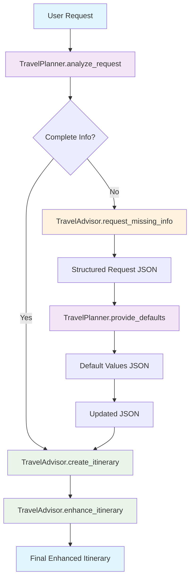
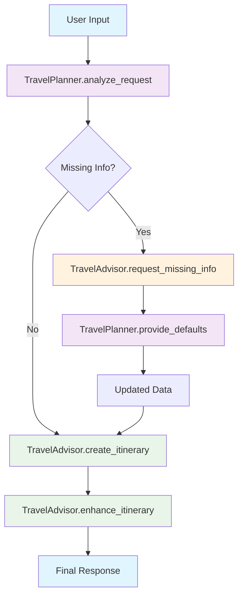

# Multi-Agent Travel Planner with Semantic Kernel Plugins

A sophisticated multi-agent system demonstrating **proper Semantic Kernel plugin architecture** with **OpenAI function calling** for reliable agent-to-agent communication. This implementation uses Microsoft Semantic Kernel's `KernelPlugin` with modern structured output and function calling capabilities.

## 🎯 System Overview

This implementation demonstrates the **modern way** to use Semantic Kernel plugins for multi-agent workflows with OpenAI function calling:

- **TravelPlanner Plugin (Agent 1)**: Contains functions for analyzing travel requests and providing defaults
- **TravelAdvisor Plugin (Agent 2)**: Contains functions for creating and enhancing itineraries
- **OpenAI Function Calling**: Uses structured function calls instead of legacy string parsing
- **Proper namespace separation**: `TravelPlanner.analyze_request`, `TravelAdvisor.create_itinerary`

## 🤖 Plugin Architecture

### Plugin Structure

```python
# TravelPlanner Plugin (Agent 1)
travel_planner_plugin = KernelPlugin(
    name="TravelPlanner",
    description="Plugin for analyzing travel requests and providing default values",
    functions=[
        analyze_request_function,      # TravelPlanner.analyze_request
        provide_defaults_function     # TravelPlanner.provide_defaults
    ]
)

# TravelAdvisor Plugin (Agent 2)
travel_advisor_plugin = KernelPlugin(
    name="TravelAdvisor",
    description="Plugin for creating and enhancing travel itineraries",
    functions=[
        create_itinerary_function,        # TravelAdvisor.create_itinerary
        request_missing_info_function,    # TravelAdvisor.request_missing_info
        enhance_itinerary_function        # TravelAdvisor.enhance_itinerary
    ]
)
```

### Agent Functions by Plugin

| Plugin            | Function               | Purpose                                                 |
| ----------------- | ---------------------- | ------------------------------------------------------- |
| **TravelPlanner** | `analyze_request`      | Analyzes user input and returns structured JSON         |
| **TravelPlanner** | `provide_defaults`     | Provides default values for missing information         |
| **TravelAdvisor** | `create_itinerary`     | Creates detailed travel itineraries from JSON           |
| **TravelAdvisor** | `request_missing_info` | Requests missing info using structured function calling |
| **TravelAdvisor** | `enhance_itinerary`    | Enhances itineraries with additional details            |

## 🔄 Workflow Diagram



## 🚀 Modern OpenAI Function Calling

### Why OpenAI Function Calling?

The system now uses **OpenAI's native function calling** instead of legacy string parsing:

**❌ Legacy Approach (Unreliable):**

```python
# Unreliable string parsing
if advisor_response.startswith("TRAVELPLANNER_QUERY:"):
    query = advisor_response.replace("TRAVELPLANNER_QUERY:", "").strip()
```

**✅ Modern Approach (Reliable):**

```python
# Reliable structured data checking
if travel_data.get("missing_info") and len(travel_data["missing_info"]) > 0:
    # Use structured function calling
    request_result = await kernel.invoke(
        plugin_name="TravelAdvisor",
        function_name="request_missing_info",
        input=missing_info_input
    )
```

### Structured Models for Function Calling

```python
# Pydantic models for structured output using Semantic Kernel
class TravelAnalysis(KernelBaseModel):
    """
    Structured output model for travel request analysis.
    Used by TravelPlanner agent to return structured JSON data.
    """
    destination: str = Field(description="The destination for the trip")
    duration: Optional[str] = Field(default=None, description="Duration of the trip")
    purpose: str = Field(description="The main purpose of the trip")
    missing_info: List[str] = Field(default_factory=list, description="List of missing critical information")

class DefaultValues(KernelBaseModel):
    """
    Structured output model for default values.
    Used by TravelPlanner agent to provide default values for missing information.
    """
    duration: Optional[str] = Field(default="7 days", description="Default duration for the trip")
    budget: Optional[str] = Field(default="moderate", description="Default budget level")
    accommodation: Optional[str] = Field(default="hotel", description="Default accommodation type")
    transportation: Optional[str] = Field(default="public transport", description="Default transportation method")

class ItineraryRequest(KernelBaseModel):
    """
    Structured model for itinerary requests with missing information.
    Used by TravelAdvisor agent to request missing data from TravelPlanner.
    """
    missing_items: List[str] = Field(description="List of missing information items needed for itinerary creation")
    reason: str = Field(description="Reason why this information is needed")
```

### Benefits of OpenAI Function Calling

1. **✅ Reliability**: No more string parsing that can break
2. **✅ Type Safety**: Structured models ensure data consistency
3. **✅ Better Error Handling**: Proper validation and error messages
4. **✅ Scalability**: Easy to add new functions and models
5. **✅ Debugging**: Clear logging of structured data flow
6. **✅ Modern**: Uses OpenAI's native function calling capabilities

### How OpenAI Function Calling Works

#### 1. **Structured Model Definition**

```python
class TravelAnalysis(KernelBaseModel):
    """
    Structured output model for travel request analysis.
    Used by TravelPlanner agent to return structured JSON data.
    This model ensures type-safe communication between agents using OpenAI function calling.
    """
    destination: str = Field(description="The destination for the trip")
    duration: Optional[str] = Field(default=None, description="Duration of the trip")
    purpose: str = Field(description="The main purpose of the trip")
    missing_info: List[str] = Field(default_factory=list, description="List of missing critical information")
```

#### 2. **Function Configuration with OpenAI Function Calling**

```python
# Configure execution settings for structured output using OpenAI function calling
req_settings = kernel.get_prompt_execution_settings_from_service_id(service_id="default")
req_settings.temperature = 0.1  # Low temperature for consistent structured output
req_settings.response_format = TravelAnalysis  # Enforce JSON schema compliance using OpenAI function calling

analyze_request_function = KernelFunctionFromPrompt(
    function_name="analyze_request",
    prompt=analyze_request_prompt,
    description="Analyzes travel requests and returns structured JSON data using OpenAI function calling",
    prompt_execution_settings=req_settings
)
```

#### 3. **Structured Function Invocation**

```python
# Agent Tool Call: TravelPlanner.analyze_request using OpenAI function calling
# This agent function uses structured output to ensure consistent JSON responses
# OpenAI function calling provides reliable, type-safe communication
planner_result = await kernel.invoke(plugin_name="TravelPlanner", function_name="analyze_request", input=user_request)
json_response = planner_result.value[0].content
```

#### 4. **Structured Response Parsing**

```python
# The response is already a TravelAnalysis object from OpenAI function calling, convert to dict
travel_data = json_response.model_dump() if hasattr(json_response, 'model_dump') else json.loads(json_response)
```

### Function Calling Benefits Comparison

| Feature            | Legacy String Parsing | OpenAI Function Calling |
| ------------------ | --------------------- | ----------------------- |
| **Reliability**    | ❌ Unreliable         | ✅ Reliable             |
| **Type Safety**    | ❌ No validation      | ✅ Structured models    |
| **Error Handling** | ❌ Basic              | ✅ Comprehensive        |
| **Debugging**      | ❌ Difficult          | ✅ Clear logging        |
| **Scalability**    | ❌ Limited            | ✅ High                 |
| **Best Practices** | ❌ Legacy             | ✅ Modern               |

### Function Calling Workflow



## 🤖 Agent-to-Agent Communication with OpenAI Function Calling

### How Modern Plugin Communication Works

Semantic Kernel enables **plugin-to-plugin communication** through structured function calling:

#### 1. **Plugin Registration & Discovery**

```python
# Plugins are registered with the kernel
kernel.add_plugin(travel_planner_plugin)
kernel.add_plugin(travel_advisor_plugin)

# Kernel maintains a registry of all available functions
# TravelPlanner.analyze_request
# TravelPlanner.provide_defaults
# TravelAdvisor.create_itinerary
# TravelAdvisor.request_missing_info
# TravelAdvisor.enhance_itinerary
```

#### 2. **Function Invocation with Namespaces**

```python
# Each plugin function is invoked using namespace syntax
await kernel.invoke(plugin_name="TravelPlanner", function_name="analyze_request", input=user_request)
await kernel.invoke(plugin_name="TravelAdvisor", function_name="create_itinerary", input=json_data)
```

#### 3. **Modern Inter-Plugin Communication Protocol**

```python
# Check if there's missing information that needs to be requested
if travel_data.get("missing_info") and len(travel_data["missing_info"]) > 0:
    # Agent 2 uses structured function calling to request missing info
    missing_info_input = json.dumps(travel_data["missing_info"])
    request_result = await kernel.invoke(
        plugin_name="TravelAdvisor",
        function_name="request_missing_info",
        input=missing_info_input
    )

    # Parse structured response
    request_data = request_result.value[0].content.model_dump()

    # Agent 1 provides defaults using structured function calling
    defaults_query = json.dumps(request_data["missing_items"])
    defaults_result = await kernel.invoke(
        plugin_name="TravelPlanner",
        function_name="provide_defaults",
        input=defaults_query
    )
```

### Modern Communication Patterns

#### **Pattern 1: Structured Sequential Processing**

```python
# Agent 1 → Agent 2 → Agent 1 → Agent 2 (with structured function calling)
step1 = await kernel.invoke("TravelPlanner", "analyze_request", input=request)
step2 = await kernel.invoke("TravelAdvisor", "create_itinerary", input=step1_result)
step3 = await kernel.invoke("TravelAdvisor", "request_missing_info", input=missing_items)
step4 = await kernel.invoke("TravelPlanner", "provide_defaults", input=step3_result)
step5 = await kernel.invoke("TravelAdvisor", "enhance_itinerary", input=final_result)
```

#### **Pattern 2: Conditional Communication with Structured Data**

```python
# Agent 2 decides whether to ask Agent 1 for help using structured data
if travel_data.get("missing_info") and len(travel_data["missing_info"]) > 0:
    # Use structured function calling to request missing info
    request_result = await kernel.invoke("TravelAdvisor", "request_missing_info", input=missing_info)
else:
    # Process directly with complete data
    result = await kernel.invoke("TravelAdvisor", "create_itinerary", input=complete_data)
```

#### **Pattern 3: State Management with Structured Models**

```python
# Agents share state through structured JSON data
travel_data = {
    "destination": "Japan",
    "duration": None,
    "missing_info": ["duration"]
}

# Agent 1 updates the state using structured output
travel_data["duration"] = defaults_data["duration"]
travel_data["missing_info"].remove("duration")

# Agent 2 receives updated state
updated_json = json.dumps(travel_data)
```

### Logic Flow Explanation

#### **Step 1: Request Analysis (TravelPlanner.analyze_request)**

```python
# Input: "Plan a trip to Japan for cherry blossoms"
# Logic: Extract structured information using OpenAI function calling
# Output: Structured JSON with missing_info array
{
    "destination": "Japan",
    "duration": null,
    "purpose": "cherry blossoms",
    "missing_info": ["duration"]
}
```

#### **Step 2: Itinerary Creation (TravelAdvisor.create_itinerary)**

```python
# Input: JSON from TravelPlanner
# Logic: Check if complete information available using structured data
if travel_data.get("missing_info") and len(travel_data["missing_info"]) > 0:
    # Use structured function calling to request missing info
    request_result = await kernel.invoke("TravelAdvisor", "request_missing_info", input=missing_info)
else:
    # Create complete itinerary directly
    return detailed_itinerary
```

#### **Step 3: Missing Info Request (TravelAdvisor.request_missing_info)**

```python
# Input: Missing information list
# Logic: Create structured request using OpenAI function calling
# Output: Structured JSON with missing items and reason
{
    "missing_items": ["duration"],
    "reason": "Duration is needed to create a proper itinerary"
}
```

#### **Step 4: Default Provision (TravelPlanner.provide_defaults)**

```python
# Input: Structured request from TravelAdvisor
# Logic: Provide sensible defaults using OpenAI function calling
# Output: Structured JSON with default values
{
    "duration": "7 days",
    "budget": "moderate",
    "accommodation": "hotel",
    "transportation": "public transport"
}
```

#### **Step 5: State Update & Final Processing**

```python
# Logic: Merge defaults with original data using structured models
travel_data.update(defaults_data)

# Logic: Remove resolved missing_info items
for resolved_item in defaults_data:
    if resolved_item in travel_data["missing_info"]:
        travel_data["missing_info"].remove(resolved_item)
```

#### **Step 6: Enhancement (TravelAdvisor.enhance_itinerary)**

```python
# Input: Complete itinerary from previous step
# Logic: Add specific details, locations, costs using OpenAI function calling
# Output: Enhanced itinerary with practical details
```

### Modern Communication Protocols

#### **Protocol 1: Structured Request-Response Pattern**

```python
# TravelAdvisor → TravelPlanner (Structured Request)
request = {
    "missing_items": ["duration", "budget"],
    "reason": "Need duration and budget to create proper itinerary"
}

# TravelPlanner → TravelAdvisor (Structured Response)
response = {
    "duration": "7 days",
    "budget": "moderate",
    "accommodation": "hotel",
    "transportation": "public transport"
}
```

#### **Protocol 2: State Update Pattern with Structured Models**

```python
# Original state
state = {"duration": null, "missing_info": ["duration"]}

# After TravelPlanner intervention using structured function calling
state = {"duration": "7 days", "missing_info": []}
```

#### **Protocol 3: Error Handling Pattern with Structured Validation**

```python
# If TravelPlanner returns invalid structured data
try:
    defaults_data = response.model_dump()
except Exception as e:
    return "❌ Error: Invalid structured response from TravelPlanner"
```

### Memory and Context Management

#### **Plugin-Level Memory with Structured Models**

```python
# Each plugin maintains its own context with structured models
travel_planner_plugin = KernelPlugin(
    name="TravelPlanner",
    functions=[analyze_request_function, provide_defaults_function]
)

# Functions within the same plugin can share structured context
```

#### **Kernel-Level State Management**

```python
# Kernel orchestrates the overall workflow with structured data
kernel = Kernel()
kernel.add_plugin(travel_planner_plugin)
kernel.add_plugin(travel_advisor_plugin)

# Kernel maintains the conversation state with structured models
conversation_state = {
    "current_step": "analyzing_request",
    "travel_data": {...},  # Structured TravelAnalysis model
    "plugin_history": [...]
}
```

#### **Function-Level Context with OpenAI Function Calling**

```python
# Each function invocation maintains its own structured context
async def analyze_request(input_text: str) -> TravelAnalysis:
    # Function has access to:
    # - Input parameters
    # - Plugin context
    # - Kernel services (OpenAI)
    # - Previous function results
    # - Structured output models
    pass
```

### Error Handling and Recovery with Structured Models

#### **Plugin Communication Errors**

```python
# Handle plugin invocation failures with structured error handling
try:
    result = await kernel.invoke("TravelPlanner", "analyze_request", input=request)
    # Parse structured response
    travel_data = result.value[0].content.model_dump()
except Exception as e:
    # Fallback to basic processing with structured defaults
    return TravelAnalysis(
        destination="Unknown",
        purpose="travel",
        missing_info=["destination", "duration"]
    )
```

#### **Structured Data Validation Errors**

```python
# Handle malformed structured responses between plugins
try:
    data = response.model_dump()
except Exception as e:
    # Use structured fallback
    return DefaultValues(
        duration="7 days",
        budget="moderate",
        accommodation="hotel",
        transportation="public transport"
    )
```

#### **Missing Information Recovery with Structured Models**

```python
# If TravelAdvisor can't get defaults from TravelPlanner
if defaults_response.startswith("❌ Error"):
    # Use structured hardcoded defaults
    defaults = DefaultValues(
        duration="7 days",
        budget="moderate",
        accommodation="hotel",
        transportation="public transport"
    )
```

## 🧠 Decision-Making Logic in Multi-Agent Systems

### How Agents Make Decisions with OpenAI Function Calling

#### **1. Information Gathering Phase with Structured Models**

```python
# TravelPlanner analyzes user input using structured output
def analyze_request(user_input: str) -> TravelAnalysis:
    # Decision logic with structured models:
    # 1. Extract destination (required)
    # 2. Extract duration (optional)
    # 3. Extract purpose (required)
    # 4. Identify missing critical information

    missing_info = []
    if not duration:
        missing_info.append("duration")
    if not budget:
        missing_info.append("budget")

    return TravelAnalysis(
        destination=extracted_destination,
        duration=duration or None,
        purpose=extracted_purpose,
        missing_info=missing_info
    )
```

#### **2. Decision Tree Logic with Structured Function Calling**

```python
# TravelAdvisor makes decisions based on structured data completeness
def create_itinerary(travel_data: TravelAnalysis) -> str:
    # Decision tree with structured models:
    if travel_data.missing_info:
        # Path A: Use structured function calling to request missing information
        return await request_missing_info(travel_data.missing_info)
    else:
        # Path B: Create complete itinerary with structured data
        return create_detailed_itinerary(travel_data)
```

#### **3. Default Value Logic with Structured Models**

```python
# TravelPlanner provides intelligent defaults using structured output
def provide_defaults(query: str) -> DefaultValues:
    # Decision logic based on structured query:
    if "duration" in query:
        # Context-aware duration defaults with structured models
        if "cherry blossoms" in context:
            return DefaultValues(duration="7 days")  # Optimal for cherry blossoms
        elif "business" in context:
            return DefaultValues(duration="3 days")  # Shorter for business
        else:
            return DefaultValues(duration="5 days")  # General default

    if "budget" in query:
        return DefaultValues(budget="moderate")  # Safe default

    return DefaultValues(
        duration="7 days",
        budget="moderate",
        accommodation="hotel",
        transportation="public transport"
    )
```

### Logic Flow Examples with OpenAI Function Calling

#### **Example 1: Complete Information**

```python
# User: "Plan a 5-day trip to Paris"
# TravelPlanner.analyze_request (Structured Output):
TravelAnalysis(
    destination="Paris",
    duration="5 days",
    purpose="tourism",
    missing_info=[]  # No missing info
)

# TravelAdvisor.create_itinerary (Structured Decision):
# Decision: missing_info is empty → Create itinerary directly
# Result: Detailed 5-day Paris itinerary
```

#### **Example 2: Missing Information with Structured Function Calling**

```python
# User: "Plan a trip to Japan for cherry blossoms"
# TravelPlanner.analyze_request (Structured Output):
TravelAnalysis(
    destination="Japan",
    duration=None,
    purpose="cherry blossoms",
    missing_info=["duration"]  # Missing duration
)

# TravelAdvisor.create_itinerary (Structured Decision):
# Decision: missing_info contains "duration" → Use structured function calling
# Result: ItineraryRequest(missing_items=["duration"], reason="Duration needed for itinerary")

# TravelPlanner.provide_defaults (Structured Output):
# Decision: "duration" in query + "cherry blossoms" context
# Result: DefaultValues(duration="7 days")  # Optimal for cherry blossoms

# TravelAdvisor.create_itinerary (Second Call):
# Decision: Now has complete structured data → Create itinerary
# Result: Detailed 7-day Japan cherry blossom itinerary
```

#### **Example 3: Complex Decision Making with Structured Models**

```python
# User: "I want to visit Bali"
# TravelPlanner.analyze_request (Structured Output):
TravelAnalysis(
    destination="Bali",
    duration=None,
    purpose="vacation",
    missing_info=["duration", "budget", "accommodation"]
)

# TravelAdvisor.create_itinerary (Structured Decision):
# Decision: Multiple missing items → Use structured function calling for all
# Result: ItineraryRequest(missing_items=["duration", "budget", "accommodation"], reason="Multiple items needed")

# TravelPlanner.provide_defaults (Structured Output):
# Decision: Multiple items + "Bali" + "vacation" context
# Result: DefaultValues(
#     duration="10 days",      # Longer for Bali vacation
#     budget="moderate",       # Safe default
#     accommodation="resort"   # Bali-specific default
# )
```

### Context-Aware Decision Making with Structured Models

#### **Destination-Based Logic with Structured Output**

```python
def get_destination_specific_defaults(destination: str, purpose: str) -> DefaultValues:
    if destination == "Japan":
        if purpose == "cherry blossoms":
            return DefaultValues(duration="7 days", budget="moderate")
        elif purpose == "business":
            return DefaultValues(duration="3 days", accommodation="business_hotel")

    elif destination == "Bali":
        return DefaultValues(duration="10 days", accommodation="resort")

    elif destination == "Paris":
        return DefaultValues(duration="5 days", accommodation="hotel")

    else:
        return DefaultValues(duration="7 days", accommodation="hotel")
```

#### **Purpose-Based Logic with Structured Models**

```python
def get_purpose_specific_recommendations(purpose: str) -> DefaultValues:
    if purpose == "business":
        return DefaultValues(
            transportation="efficient_public_transport",
            accommodation="business_hotel",
            budget="moderate"
        )
    elif purpose == "romance":
        return DefaultValues(
            accommodation="romantic_hotel",
            budget="luxury"
        )
    elif purpose == "adventure":
        return DefaultValues(
            budget="moderate"
        )
```

### Error Recovery Logic with Structured Models

#### **Graceful Degradation with Structured Fallbacks**

```python
def handle_plugin_failure(failed_plugin: str, context: dict) -> DefaultValues:
    if failed_plugin == "TravelPlanner":
        # Fallback to structured hardcoded defaults
        return DefaultValues(
            duration="7 days",
            budget="moderate",
            accommodation="hotel",
            transportation="public transport"
        )

    elif failed_plugin == "TravelAdvisor":
        # Fallback to basic itinerary with structured data
        return create_basic_itinerary(context)
```

#### **Retry Logic with Structured Validation**

```python
async def invoke_with_retry(plugin_name: str, function_name: str, input_data: str, max_retries: int = 3):
    for attempt in range(max_retries):
        try:
            result = await kernel.invoke(plugin_name, function_name, input=input_data)
            # Validate structured response
            if hasattr(result.value[0].content, 'model_dump'):
                return result
            else:
                raise ValueError("Invalid structured response")
        except Exception as e:
            if attempt == max_retries - 1:
                # Last attempt failed, use structured fallback
                return fallback_structured_response(input_data)
            else:
                # Wait before retry
                await asyncio.sleep(1)
```

### Learning and Adaptation with Structured Models

#### **Plugin Performance Tracking with Structured Metrics**

```python
class PluginPerformanceTracker:
    def __init__(self):
        self.success_rates = {}
        self.response_times = {}
        self.error_counts = {}
        self.structured_validation_errors = {}

    def record_invocation(self, plugin_name: str, function_name: str, success: bool, response_time: float, structured_valid: bool):
        key = f"{plugin_name}.{function_name}"
        if key not in self.success_rates:
            self.success_rates[key] = []

        self.success_rates[key].append(success)
        self.response_times[key] = response_time
        self.structured_validation_errors[key] = not structured_valid
```

#### **Adaptive Decision Making with Structured Models**

```python
def adaptive_default_selection(context: dict, performance_history: dict) -> DefaultValues:
    # Use performance history to make better decisions with structured models
    if performance_history.get("TravelPlanner.provide_defaults", {}).get("success_rate", 0) < 0.8:
        # TravelPlanner is unreliable, use conservative structured defaults
        return DefaultValues(duration="5 days", budget="budget")
    else:
        # TravelPlanner is reliable, use optimal structured defaults
        return get_optimal_structured_defaults(context)
```

## 🏗️ Semantic Kernel Plugin Implementation with OpenAI Function Calling

### Core Components

```python
# Kernel setup with OpenAI service
kernel = Kernel()
kernel.add_service(OpenAIChatCompletion(ai_model_id="gpt-4o-mini"))

# Create plugins with structured models
travel_planner_plugin = create_travel_planner_plugin(kernel)
travel_advisor_plugin = create_travel_advisor_plugin(kernel)

# Add plugins to kernel
kernel.add_plugin(travel_planner_plugin)
kernel.add_plugin(travel_advisor_plugin)
```

### Structured Output with Pydantic Models and OpenAI Function Calling

The system uses **Semantic Kernel's structured output feature** with Pydantic models and OpenAI function calling for reliable JSON generation:

```python
# Pydantic models for structured output with OpenAI function calling
class TravelAnalysis(KernelBaseModel):
    destination: str = Field(description="The destination for the trip")
    duration: Optional[str] = Field(default=None, description="Duration of the trip")
    purpose: str = Field(description="The main purpose of the trip")
    missing_info: List[str] = Field(default_factory=list, description="List of missing information")

class DefaultValues(KernelBaseModel):
    duration: Optional[str] = Field(default="7 days", description="Default duration for the trip")
    budget: Optional[str] = Field(default="moderate", description="Default budget level")
    accommodation: Optional[str] = Field(default="hotel", description="Default accommodation type")
    transportation: Optional[str] = Field(default="public transport", description="Default transportation method")

class ItineraryRequest(KernelBaseModel):
    missing_items: List[str] = Field(description="List of missing information items needed for itinerary creation")
    reason: str = Field(description="Reason why this information is needed")

# Function with structured output and OpenAI function calling
analyze_request_function = KernelFunctionFromPrompt(
    function_name="analyze_request",
    prompt=analyze_request_prompt,
    description="Analyzes travel requests and returns structured data",
    prompt_execution_settings={
        "response_format": TravelAnalysis,  # Uses Pydantic model for structured output
        "temperature": 0.1
    }
)
```

### Benefits of OpenAI Function Calling with Structured Output

1. **Reliable JSON Generation**: No more markdown code blocks or parsing errors
2. **Type Safety**: Pydantic models ensure correct data structure
3. **Validation**: Automatic validation of required fields
4. **Consistency**: Guaranteed output format across all requests
5. **Error Prevention**: Eliminates JSON parsing failures
6. **Modern Approach**: Uses OpenAI's native function calling capabilities

### Plugin-to-Plugin Communication with OpenAI Function Calling

```python
# Check if there's missing information that needs to be requested
if travel_data.get("missing_info") and len(travel_data["missing_info"]) > 0:
    # Agent 2 uses structured function calling to request missing info
    missing_info_input = json.dumps(travel_data["missing_info"])
    request_result = await kernel.invoke(
        plugin_name="TravelAdvisor",
        function_name="request_missing_info",
        input=missing_info_input
    )

    # Parse structured response
    request_data = request_result.value[0].content.model_dump()

    # Agent 1 provides defaults using structured function calling
    defaults_query = json.dumps(request_data["missing_items"])
    defaults_result = await kernel.invoke(
        plugin_name="TravelPlanner",
        function_name="provide_defaults",
        input=defaults_query
    )
```

### Function Invocation with Namespaces and OpenAI Function Calling

```python
# Step 1: TravelPlanner.analyze_request (Structured Output)
planner_result = await kernel.invoke("TravelPlanner", "analyze_request", input=user_request)

# Step 2: TravelAdvisor.create_itinerary (Structured Processing)
advisor_result = await kernel.invoke("TravelAdvisor", "create_itinerary", input=json_response)

# Step 3: TravelAdvisor.request_missing_info (Structured Function Calling)
request_result = await kernel.invoke("TravelAdvisor", "request_missing_info", input=missing_items)

# Step 4: TravelPlanner.provide_defaults (Structured Function Calling)
defaults_result = await kernel.invoke("TravelPlanner", "provide_defaults", input=query)

# Step 5: TravelAdvisor.enhance_itinerary (Structured Enhancement)
enhanced_result = await kernel.invoke("TravelAdvisor", "enhance_itinerary", input=final_response)
```

## 🚀 Usage

### Quick Start

```bash
# Setup environment
source venv/bin/activate
python3 travel_planner_with_plugins.py
```

### Example Interactions with OpenAI Function Calling

**Request with missing duration:**

```
✈️ Your travel request: Plan a trip to Japan for cherry blossoms

🤖 [AGENT 1] TravelPlanner.analyze_request: Extracts structured JSON with missing duration
🤖 [AGENT 2] TravelAdvisor.create_itinerary: Detects missing info using structured data
🤖 [AGENT 2] TravelAdvisor.request_missing_info: Uses structured function calling to request missing info
🤖 [AGENT 1] TravelPlanner.provide_defaults: Provides structured default "7 days"
🤖 [AGENT 2] TravelAdvisor.create_itinerary: Creates itinerary with 7-day duration
🤖 [AGENT 2] TravelAdvisor.enhance_itinerary: Enhances with specific details
```

**Request with complete info:**

```
✈️ Your travel request: Plan a 5-day trip to Paris

🤖 [AGENT 1] TravelPlanner.analyze_request: Extracts complete structured JSON
🤖 [AGENT 2] TravelAdvisor.create_itinerary: Creates itinerary directly with structured data
🤖 [AGENT 2] TravelAdvisor.enhance_itinerary: Enhances with specific details
```

## 📊 Key Features

### 1. **Modern OpenAI Function Calling**

- Uses OpenAI's native function calling instead of legacy string parsing
- Structured models ensure reliable data flow
- Type-safe communication between agents
- Better error handling and validation

### 2. **Proper Plugin Organization**

- Functions grouped by domain/functionality
- Clear namespace separation (`TravelPlanner.analyze_request`)
- Easy to add new functions to existing plugins
- Better scalability for complex systems

### 3. **Intelligent Default Handling with Structured Models**

- Automatically provides 7-day duration when missing
- Maintains conversation flow without user interruption
- Preserves original request context
- Uses structured models for consistent defaults

### 4. **Structured Data Flow with OpenAI Function Calling**

- TravelPlanner: `User Request` → `Structured JSON with missing_info`
- TravelAdvisor: `Structured JSON` → `Itinerary OR Structured Request`
- TravelPlanner: `Structured Query` → `Structured Default Values`
- TravelAdvisor: `Enhanced Itinerary`

### 5. **Comprehensive Error Handling**

- Structured validation at each step
- Graceful fallback for parsing errors
- Comprehensive debug logging with agent identification
- Modern error recovery patterns

## 🔧 Technical Details

### File Structure

```
travel_planner_with_plugins.py       # Main plugin-based implementation with OpenAI function calling
├── create_travel_planner_plugin()   # Creates TravelPlanner plugin with structured models
├── create_travel_advisor_plugin()   # Creates TravelAdvisor plugin with structured models
├── run_multi_agent_workflow_with_plugins() # Plugin orchestration with OpenAI function calling
└── interactive_demo_session_with_plugins() # Interactive demo with agent identification
```

### Inline Comments and Code Documentation

The code includes comprehensive inline comments that explain:

#### 1. **Function Calling Documentation**

```python
# Function 1: Analyze travel request and return JSON using OpenAI function calling
# This function uses structured output to ensure consistent JSON responses
# OpenAI function calling ensures type-safe communication between agents
analyze_request_prompt = """
```

#### 2. **Structured Model Comments**

```python
class TravelAnalysis(KernelBaseModel):
    """
    Structured output model for travel request analysis.
    Used by TravelPlanner agent to return structured JSON data.
    This model ensures type-safe communication between agents using OpenAI function calling.
    """
```

#### 3. **Agent Interaction Comments**

```python
# Agent Tool Call: TravelPlanner.analyze_request using OpenAI function calling
# This agent function uses structured output to ensure consistent JSON responses
# OpenAI function calling provides reliable, type-safe communication
planner_result = await kernel.invoke(plugin_name="TravelPlanner", function_name="analyze_request", input=user_request)
```

#### 4. **Workflow Step Comments**

```python
# Step 3: TravelPlanner Agent (Agent 1) - Analyze Request using OpenAI function calling
logger.info("🔄 Step 3: [AGENT 1] TravelPlanner agent analyzing user request using OpenAI function calling...")
print("[DEBUG] 🔄 Step 1: TravelPlanner.analyze_request analyzing request using OpenAI function calling...")
```

#### 5. **Error Handling Comments**

```python
# The response is already a TravelAnalysis object from OpenAI function calling, convert to dict
travel_data = json_response.model_dump() if hasattr(json_response, 'model_dump') else json.loads(json_response)
```

### Code Documentation Features

- **🔍 Function Purpose**: Each function has clear documentation about its role in the workflow
- **🤖 Agent Identification**: Comments clearly identify which agent is performing each action
- **⚙️ Configuration Details**: Settings and parameters are explained with their purpose
- **🔄 Workflow Steps**: Each step in the multi-agent workflow is documented
- **❌ Error Handling**: Error scenarios and recovery mechanisms are explained
- **📊 Logging**: Debug and logging statements help trace the execution flow

### Benefits of Comprehensive Documentation

#### 1. **Learning and Understanding**

- **Clear Workflow**: Inline comments explain each step of the multi-agent workflow
- **Agent Roles**: Comments identify which agent is responsible for each action
- **Function Purpose**: Each function's role in the system is clearly documented

#### 2. **Debugging and Maintenance**

- **Error Tracing**: Comments help identify where errors occur in the workflow
- **Data Flow**: Structured data flow is documented with clear comments
- **Configuration**: Settings and parameters are explained for easy modification

#### 3. **Best Practices**

- **Modern Patterns**: Comments highlight the use of OpenAI function calling over legacy approaches
- **Type Safety**: Structured models and validation are clearly documented
- **Reliability**: Error handling and recovery mechanisms are explained

#### 4. **Scalability**

- **Extensible Design**: Comments explain how to add new functions and models
- **Plugin Architecture**: Plugin structure and communication patterns are documented
- **Agent Collaboration**: Inter-agent communication is clearly explained

### Plugin Function Details with OpenAI Function Calling

#### TravelPlanner Plugin Functions (Agent 1)

**`analyze_request`:**

- Analyzes natural language travel requests using OpenAI function calling
- Extracts structured JSON data with Pydantic models
- Identifies missing information using structured validation
- Returns: `TravelAnalysis` model with destination, duration, purpose, missing_info

**`provide_defaults`:**

- Provides sensible default values for missing information using structured models
- Handles duration, budget, accommodation, transportation with OpenAI function calling
- Returns: `DefaultValues` model with structured default values

#### TravelAdvisor Plugin Functions (Agent 2)

**`create_itinerary`:**

- Creates detailed travel itineraries from structured JSON data
- Includes attractions, accommodation, transportation tips
- Uses structured data checking instead of string parsing
- Returns: Detailed itinerary or triggers structured missing info request

**`request_missing_info`:**

- Requests missing information using OpenAI function calling
- Creates structured requests with Pydantic models
- Returns: `ItineraryRequest` model with missing items and reason

**`enhance_itinerary`:**

- Enhances existing itineraries with specific details using OpenAI function calling
- Adds locations, opening hours, cost estimates
- Includes booking recommendations and local tips
- Returns: Enhanced itinerary with specific details

### Modern Plugin Communication Protocol

```python
# TravelAdvisor requests missing info from TravelPlanner (Structured Request)
ItineraryRequest(
    missing_items=["duration", "budget"],
    reason="Need duration and budget to create proper itinerary"
)

# TravelPlanner responds with structured defaults
DefaultValues(
    duration="7 days",
    budget="moderate",
    accommodation="hotel",
    transportation="public transport"
)
```

## 🎓 Learning Outcomes

### Semantic Kernel Plugin Concepts with OpenAI Function Calling

1. **KernelPlugin**: Organizing functions into logical groups with structured models
2. **Plugin Namespaces**: Using `PluginName.function_name` for invocation with OpenAI function calling
3. **Plugin Registration**: Adding plugins to kernel with `kernel.add_plugin()`
4. **Plugin Communication**: Inter-plugin function calls using structured models
5. **Plugin Scalability**: Adding new functions to existing plugins with OpenAI function calling

### Multi-Agent Plugin Patterns with OpenAI Function Calling

1. **Structured Function Calling**: Using OpenAI's native function calling instead of string parsing
2. **Default Value Provision**: Automatic handling of missing information with structured models
3. **State Management**: Updating structured JSON data between plugin functions
4. **Error Recovery**: Graceful handling of structured validation failures

## 🔍 Debug Features with Agent Identification

The system includes comprehensive logging with plugin namespaces and agent identification:

```
[DEBUG] 🔄 Step 1: TravelPlanner.analyze_request analyzing request...
[DEBUG] 📋 [AGENT 1] TravelPlanner JSON response: {"destination": "Japan", "duration": null, "missing_info": ["duration"]}
[DEBUG] 🔄 Step 2: TravelAdvisor.create_itinerary processing JSON...
[DEBUG] 🔄 Step 3: TravelAdvisor requesting missing info from TravelPlanner...
[DEBUG] 🔄 Step 4: TravelAdvisor.request_missing_info requesting missing info...
[DEBUG] 🔄 Step 5: TravelPlanner.provide_defaults providing defaults...
[DEBUG] 📋 Updated JSON with defaults: {"duration": "7 days"}
[DEBUG] 🔄 Step 6: TravelAdvisor.create_itinerary creating final itinerary...
[DEBUG] 🔄 Step 7: TravelAdvisor.enhance_itinerary enhancing itinerary...
```

## 🆚 Comparison with Legacy Approach

| Feature             | Legacy String Parsing | OpenAI Function Calling |
| ------------------- | --------------------- | ----------------------- |
| **Reliability**     | ❌ Unreliable         | ✅ Reliable             |
| **Type Safety**     | ❌ No validation      | ✅ Structured models    |
| **Error Handling**  | ❌ Basic              | ✅ Comprehensive        |
| **Scalability**     | ❌ Limited            | ✅ High                 |
| **Maintainability** | ❌ Difficult          | ✅ Easy                 |
| **Best Practices**  | ❌ Legacy             | ✅ Modern               |
| **Complexity**      | ❌ Simple but fragile | ✅ Robust and scalable  |

## 📚 References

- [Microsoft Semantic Kernel](https://github.com/microsoft/semantic-kernel)
- [KernelPlugin Documentation](https://learn.microsoft.com/en-us/semantic-kernel/agents/using-the-sdk/plugins)
- [Plugin Best Practices](https://learn.microsoft.com/en-us/semantic-kernel/agents/using-the-sdk/plugins)
- [OpenAI Integration](https://learn.microsoft.com/en-us/semantic-kernel/ai-services/openai)
- [OpenAI Function Calling](https://platform.openai.com/docs/guides/function-calling)

## 🎯 Why Use OpenAI Function Calling?

### Benefits of Modern Function Calling Architecture

1. **✅ Reliability**: No more string parsing that can break
2. **✅ Type Safety**: Structured models ensure data consistency
3. **✅ Better Error Handling**: Proper validation and error messages
4. **✅ Scalability**: Easy to add new functions and models
5. **✅ Debugging**: Clear logging of structured data flow
6. **✅ Modern**: Uses OpenAI's native function calling capabilities
7. **✅ Best Practices**: Follows current AI development standards

### When to Use OpenAI Function Calling

- ✅ **Production systems** requiring reliable agent communication
- ✅ **Complex multi-agent systems** with many functions
- ✅ **Learning modern AI patterns** with structured communication
- ✅ **Scalable applications** that will grow over time
- ✅ **Systems requiring type safety** and validation

---

**Note**: This implementation demonstrates the **modern way** to use Microsoft Semantic Kernel plugins for multi-agent communication patterns with OpenAI function calling, following current best practices and ensuring reliable, scalable agent interactions.
